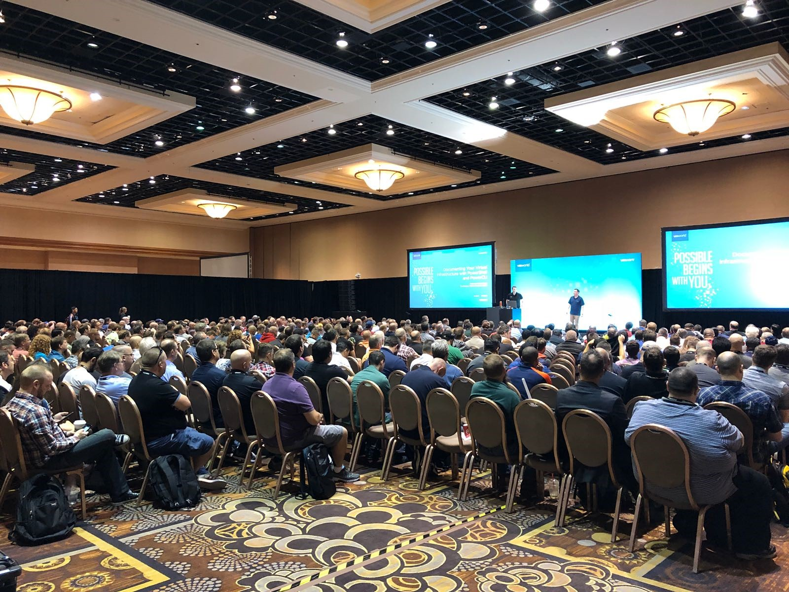

# The history of As Built Report

## The Beginning

Back in 2017, having worked on designing and implementing VMware solutions for almost a decade, I became frustrated with having to repeatedly produce as-built documentation for my virtualisation projects.

At the time, I was designing and implementing 2-3 VMware solutions per month. Each solution would be designed using numerous technology partners, each with their own range of compute, storage, networking and backup technologies.

My methods to create as-built documentation was arduous, time consuming and error prone. It often involved extracting information using a combination of vendor supplied tools and community developed scripts, and manually transposing information from the vCenter console into a Word document. It was tedious and often resulted in a poorly constructed and formatted document.

It was also around this time that I realised I had a strong desire to learn PowerShell after seeing many of my co-workers starting to write scripts to automate simple, repeatable tasks. Until this moment, I had never taken the time to completely understand the fundamentals of PowerShell, nor had I worked to develop and expand my knowledge in any form of scripting or automation.

As a result, I saw this as an opportunity to learn and employ PowerShell automation to ease my pain and frustrations with producing as-built documentation. And so began my mission to create As Built Report!

<!-- more -->
## As Built Report was born!

As Built Report began as a single PowerShell script to capture information from VMware vSphere environments, however I quickly realised that my need to produce as-built documentation needed to extend beyond just VMware, and required the ability to capture information from a wide range of vendors and technologies.

After developing the basic concepts of gathering information from VMware vSphere using PowerCLI, I was left without a mechanism to present and output the information in an acceptable document format. Had it not been for a colleague telling me about [PScribo](../../support/faq.md#what-is-pscribo), I doubt As Built Report would have ever seen the light of day.

PScribo was the solution I had long been searching for. Not only did it provide the capabilities to export information into Word, HTML and Text formats, it was also extremely simple to grasp and implement. I now had all the pieces to the puzzle!

In March 2018, I delivered my first ever [presentation](https://speakerdeck.com/tpcarman/vmug-usercon-2018-documenting-your-virtual-infrastructure-with-powershell-and-powercli){:target="_blank"} at the Melbourne VMUG User Conference, to showcase my initial work on the VMware vSphere as-built script. My presentation, despite its terrible delivery, was warmly welcomed by the local audience, giving me the confidence and motivation I needed to keep working on the script.

As Built Report had taken months of my personal effort to produce by this point. I understood then, as I had known from the start, that it would be impossible for me to continue developing the project on my own. Having benefited so much from VMware's community contributions, I saw this as my opportunity to give back to the vCommunity by sharing what I had created, and allowing others to develop their own reports.

## VMworld US 2018

In August 2018, [Matt Allford](../../about/contributors.md#matt-allford) and I presented ['Documenting Your Virtual Infrastructure with PowerShell and PowerCLI'](https://www.youtube.com/watch?v=aQqHSEIUHl8){:target="_blank"} to a worldwide audience of 500+ people at VMworld in Las Vegas. Our session would go on to be the highest viewed session for the entire VMworld US conference. The word was out and the excitement began to grow.

{ loading=lazy }

<iframe width="600" height="400" src="https://www.youtube.com/embed/aQqHSEIUHl8?si=0gfNzm7rN5fujvhl" title="YouTube video player" frameborder="0" allow="accelerometer; autoplay; clipboard-write; encrypted-media; gyroscope; picture-in-picture; web-share" allowfullscreen></iframe>

## The Evolution

Soon after VMworld, we began work on redesigning the core architecture of As Built Report to make it more modular to support different report modules. This eventually evolved into the As Built Report framework and the [AsBuiltReport.Core module](https://www.powershellgallery.com/packages/AsBuiltReport.Core/){:target="_blank"}. With the core framework now in place, I worked on refactoring the VMware vSphere script and developing some other report modules.

Since then, the project has been open-sourced and has continued to grow, with code published to our [GitHub repository](https://github.com/AsBuiltReport){:target="_blank"} and modules released to the [PowerShell Gallery](https://www.powershellgallery.com/packages?q=AsBuiltReport*){:target="_blank"}.

And thanks to contributions from [Jonathan Colon](../../about/contributors.md#jonathan-colon), [Mike Preston](https://github.com/mwpreston){:target="_blank"}, [Alexis La Goutte](https://github.com/alagoutte){:target="_blank"}, [Chris Hildebrandt](https://github.com/childebrandt42){:target="_blank"} and [others](../../about/contributors.md#other-contributors) we have now expanded our [range of report modules](../../user-guide/report-modules/overview.md), with many more in development!