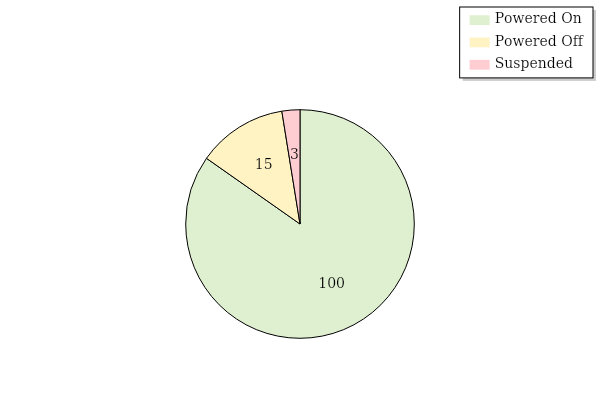
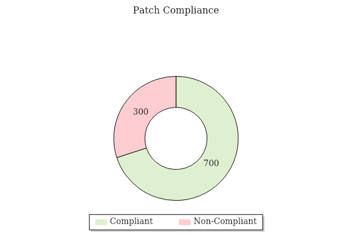
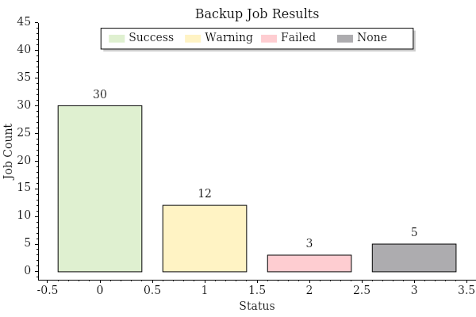
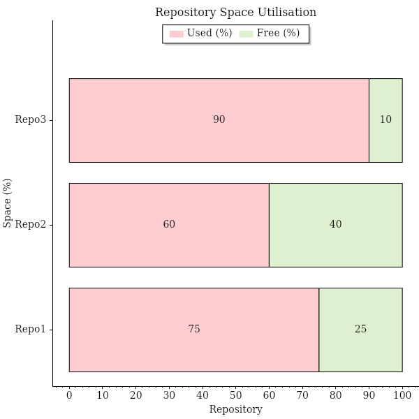
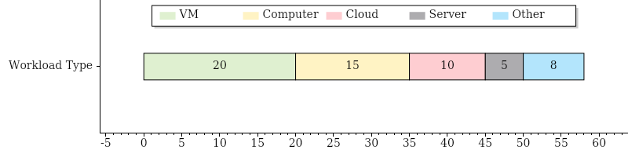
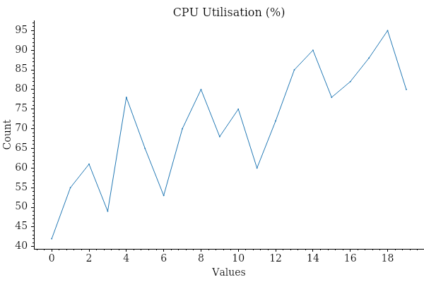
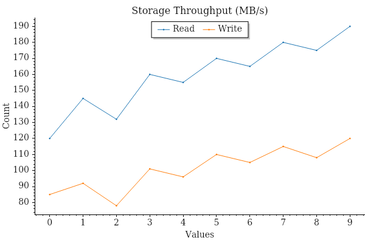
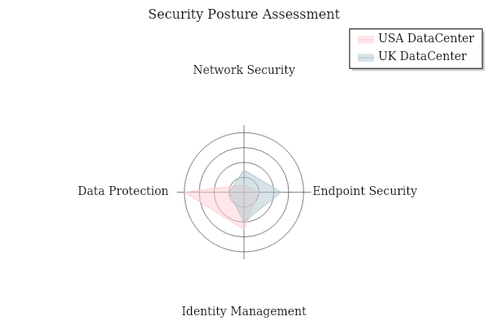
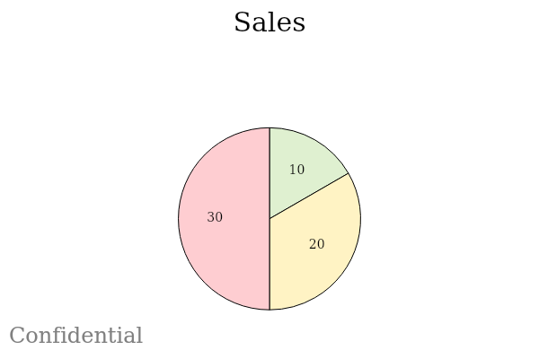

# Adding Charts to a Report Module

AsBuiltReport.Chart is an optional PowerShell module that adds chart generation capabilities to AsBuiltReport report modules. It provides seven chart types — pie, donut, bar, stacked bar, single stacked bar, radar, and signal — and integrates directly with the PScribo document framework used by AsBuiltReport.

Charts are generated in memory as base64-encoded images and embedded directly into the report output using PScribo's `Image` cmdlet. No intermediate files are written to disk.

!!! info "Prerequisite Reading"
    This guide assumes you are already familiar with creating AsBuiltReport report modules. If not, read the [Creating a Report Module](creating-a-report-module.md) guide first.

## Installation

Install AsBuiltReport.Chart from the PowerShell Gallery:

```powershell title="Install AsBuiltReport.Chart"
Install-Module -Name AsBuiltReport.Chart -Scope CurrentUser
```

## Declaring the Dependency

Add `AsBuiltReport.Chart` to the `RequiredModules` array in your module manifest (`.psd1`). This ensures the module is automatically installed when your report module is installed.

```powershell title="Module manifest (.psd1) — RequiredModules"
RequiredModules = @(
    @{
        ModuleName    = 'AsBuiltReport.Core'
        ModuleVersion = '1.6.4'
    }
    @{
        ModuleName    = 'AsBuiltReport.Chart'
        ModuleVersion = '0.3.2'
    }
)
```

## How Charts Are Embedded

All chart cmdlets accept a `-Format base64` parameter that returns the chart as a base64-encoded string rather than writing a file to disk. This string is then passed directly to PScribo's `Image` cmdlet.

```powershell title="Core integration pattern"
# Generate chart as base64 string
$chartFileItem = New-PieChart -Title 'VM Power States' `
    -Values $chartValues `
    -Labels $chartLabels `
    -Format base64 `
    -Width 600 -Height 400

# Embed the chart in the PScribo report
if ($chartFileItem) {
    Image -Text 'VM Power State Distribution' -Align 'Center' -Percent 100 -Base64 $chartFileItem
}
```

The `Image` cmdlet is provided by PScribo and is available inside any `Section` block in your report module.

## Data Preparation

Chart cmdlets require their input arrays to be explicitly typed. Always cast labels to `[string[]]` and values to `[double[]]` before passing them to a chart cmdlet.

```powershell title="Casting arrays for chart input"
$sampleData = [ordered]@{
    'Success' = 85
    'Warning' = 12
    'Failed'  = 3
}

$chartLabels = [string[]]$sampleData.Keys
$chartValues = [double[]]$sampleData.Values
```

## Chart Types

### Pie Chart

Use `New-PieChart` to show proportional distribution across categories — for example, VM power states, job results, or license usage by type.

```powershell title="Pie chart — VM power state distribution"
$sampleData = [ordered]@{
    'Powered On'  = ($VMs | Where-Object { $_.PowerState -eq 'PoweredOn' } | Measure-Object).Count
    'Powered Off' = ($VMs | Where-Object { $_.PowerState -eq 'PoweredOff' } | Measure-Object).Count
    'Suspended'   = ($VMs | Where-Object { $_.PowerState -eq 'Suspended' } | Measure-Object).Count
}

$chartLabels = [string[]]$sampleData.Keys
$chartValues = [double[]]$sampleData.Values

$chartFileItem = New-PieChart `
    -Title ' ' `
    -Values $chartValues `
    -Labels $chartLabels `
    -EnableCustomColorPalette `
    -CustomColorPalette @('#DFF0D0', '#FFF3C4', '#FECDD1') `
    -Width 600 -Height 400 `
    -Format base64 `
    -EnableLegend `
    -LegendOrientation Vertical `
    -LegendAlignment UpperRight `
    -TitleFontBold `
    -TitleFontSize 16
```
##### Pie Chart example output:


### Donut Chart

Use `New-DonutChart` for the same use cases as a pie chart when you want to emphasise completion. Donut charts can also be used to show progress towards a goal — for example, patch compliance percentage or licence consumption.

```powershell title="Donut chart — VM power state distribution"
$sampleData = [ordered]@{
    'Compliant'  = ($ComputersPatched | Measure-Object).Count
    'Non-Compliant'   = ($ComputersNotPatched | Measure-Object).Count
}

$chartLabels = [string[]]$sampleData.Keys
$chartValues = [double[]]$sampleData.Values

$chartFileItem = New-DonutChart `
    -Values $chartValues `
    -Labels $chartLabels `
    -EnableCustomColorPalette `
    -CustomColorPalette @('#DFF0D0', '#FECDD1') `
    -Width 600 -Height 400 `
    -Format base64 `
    -EnableLegend `
    -LegendOrientation Horizontal `
    -LegendAlignment LowerCenter `
    -TitleFontBold `
    -TitleFontSize 16
```
##### Donut Chart example output:



### Bar Chart

Use `New-BarChart` to compare values across discrete categories — for example, backup job results by status, or compliance check outcomes.

```powershell title="Bar chart — backup job results by status"
$sampleData = [ordered]@{
    'Success' = ($Jobs | Where-Object { $_.LatestStatus -eq 'Success' } | Measure-Object).Count
    'Warning' = ($Jobs | Where-Object { $_.LatestStatus -eq 'Warning' } | Measure-Object).Count
    'Failed'  = ($Jobs | Where-Object { $_.LatestStatus -eq 'Failed' } | Measure-Object).Count
    'None'    = ($Jobs | Where-Object { $_.LatestStatus -eq 'None' } | Measure-Object).Count
}

$chartLabels = [string[]]$sampleData.Keys
$chartValues = [double[]]$sampleData.Values

$chartFileItem = New-BarChart `
    -Title 'Backup Job Results' `
    -Values $chartValues `
    -Labels $chartLabels `
    -LabelXAxis 'Status' `
    -LabelYAxis 'Job Count' `
    -EnableCustomColorPalette `
    -CustomColorPalette @('#DFF0D0', '#FFF3C4', '#FECDD1', '#ADACAF') `
    -Width 600 -Height 400 `
    -Format base64 `
    -EnableLegend `
    -LegendOrientation Horizontal `
    -LegendAlignment UpperCenter `
    -AxesMarginsTop 0.5 `
    -TitleFontBold `
    -TitleFontSize 16
```

##### Bar Chart example output:


### Stacked Bar Chart

Use `New-StackedBarChart` when each bar is composed of multiple segments — for example, repository used space vs. free space, or resource allocation across multiple hosts.

The `-Values` parameter expects an array of arrays: one inner array per bar, with each element representing a segment value.

```powershell title="Stacked bar chart — repository space utilisation"
$sampleData = $Repositories | Select-Object Name, UsedSpacePercent, FreeSpacePercent

$chartLabels    = [string[]]$sampleData.Name
$chartCategories = @('Used (%)', 'Free (%)')
$chartUsedValues = [double[]]$sampleData.UsedSpacePercent
$chartFreeValues = [double[]]$sampleData.FreeSpacePercent

# Build array-of-arrays: one inner array per bar (one per repository)
$chartValues = @()
foreach ($i in 0..($chartLabels.Count - 1)) {
    $chartValues += , @($chartUsedValues[$i], $chartFreeValues[$i])
}

$chartFileItem = New-StackedBarChart `
    -Title 'Repository Space Utilisation' `
    -Values $chartValues `
    -Labels $chartLabels `
    -LegendCategories $chartCategories `
    -EnableCustomColorPalette `
    -CustomColorPalette @('#FECDD1', '#DFF0D0') `
    -Width 600 -Height 600 `
    -Format base64 `
    -AreaOrientation Horizontal `
    -LabelXAxis 'Space (%)' `
    -LabelYAxis 'Repository' `
    -EnableLegend `
    -LegendOrientation Horizontal `
    -LegendAlignment UpperCenter `
    -AxesMarginsTop 0.2 `
    -TitleFontBold `
    -TitleFontSize 16
```

##### Stacked Bar Chart example output:


### Single Stacked Bar Chart

Use `New-SingleStackedBarChart` to show a single bar divided into labelled segments — useful for illustrating licence consumption or a single capacity resource.

```powershell title="Single stacked bar chart — licence consumption by workload type"
$chartLabels = [string[]]$LicenseUsage.WorkloadType
$chartValues = [double[]]$LicenseUsage.UsedInstances

$chartFileItem = New-SingleStackedBarChart `
    -Title ' ' `
    -Values $chartValues `
    -Label 'Workload Type' `
    -LegendCategories $chartLabels `
    -EnableCustomColorPalette `
    -CustomColorPalette @('#DFF0D0', '#FFF3C4', '#FECDD1', '#ADACAF', '#B3E5FC', '#F8BBD0') `
    -Width 600 -Height 200 `
    -Format base64 `
    -AreaOrientation Horizontal `
    -EnableLegend `
    -LegendOrientation Horizontal `
    -LegendAlignment UpperCenter `
    -TitleFontBold `
    -TitleFontSize 16
```

##### Single Stacked Bar Chart example output:


### Signal Chart

Use `New-SignalChart` for time-series or trend data — for example, CPU utilisation over time or throughput metrics. The `-Values` parameter expects an array of arrays, where each inner array represents one line.

```powershell title="Signal chart — CPU utilisation trend (single line)"
# Wrap a single line's values in a jagged array
$chartValues = @(,[double[]]@(42, 55, 61, 49, 78, 65, 53))

$chartFileItem = New-SignalChart `
    -Title 'CPU Utilisation (%)' `
    -Values $chartValues `
    -Format base64 `
    -Width 600 -Height 400 `
    -TitleFontBold `
    -TitleFontSize 16
```

##### Signal Chart example output:


```powershell title="Signal chart — multi-line throughput trend"
$readThroughput  = [double[]]@(120, 145, 132, 160, 155)
$writeThroughput = [double[]]@(85,  92,  78,  101, 96)

$chartValues = @(,$readThroughput) + @(,$writeThroughput)

$chartFileItem = New-SignalChart `
    -Title 'Storage Throughput (MB/s)' `
    -Values $chartValues `
    -Labels @('Read', 'Write') `
    -Format base64 `
    -Width 600 -Height 400 `
    -EnableLegend `
    -LegendOrientation Horizontal `
    -LegendAlignment UpperCenter `
    -TitleFontBold `
    -TitleFontSize 16
```

##### Multi-line Signal Chart example output:


### Radar Chart

Use `New-RadarChart` to compare multiple categories across datasets — for example, security posture scores across different data centres, or feature compatibility across product versions. The radar chart is ideal for multi-dimensional performance metrics or assessment matrices where each "spoke" represents a discrete category.

**Basic example** — single dataset:

```powershell title="Radar chart — single data centre security posture"
# For a single dataset, wrap the values array with a comma operator
$chartValues = ,@([double[]]@(3, 5, 4, 2))
$chartLabels = @('USA DataCenter')

$chartFileItem = New-RadarChart `
    -Title 'Security Posture Assessment' `
    -Values $chartValues `
    -LegendLabels $chartLabels `
    -Format base64 `
    -Width 600 -Height 400 `
    -ColorPalette Category20 `
    -EnableLegend `
    -TitleFontBold `
    -TitleFontSize 16
```

**Advanced example** — multiple datasets with spoke labels:

```powershell title="Radar chart — multi-site security posture comparison"
# Multiple datasets: array of arrays, one per dataset
$chartValues = @(
    @([double[]]@(1, 2, 5, 8)),      # USA DataCenter scores
    @([double[]]@(3, 5, 4, 2))       # UK DataCenter scores
)

$chartLabels = @('USA DataCenter', 'UK DataCenter')
$spokes = @('Network Security', 'Endpoint Security', 'Identity Management', 'Data Protection')

$chartFileItem = New-RadarChart `
    -Title 'Security Posture Assessment' `
    -Values $chartValues `
    -LegendLabels $chartLabels `
    -SpokeLabels $spokes `
    -SpokesLength 9 `
    -Format base64 `
    -Width 600 -Height 400 `
    -ColorPalette Aurora `
    -EnableLegend `
    -TitleFontBold `
    -TitleFontSize 16
```

##### Radar Chart example output:


**Key parameters:**

- `-Values` — Array or array of arrays of numeric values (one value per spoke, one array per dataset)
- `-LegendLabels` — Labels for each dataset (one label per array in `-Values`)
- `-SpokeLabels` — Optional labels for each spoke/axis on the radar
- `-SpokesLength` — Length of the spokes (axes); omit or set to 0 for auto-scaling

## Safety Guards

Chart generation can return `$null` if data is empty or an error occurs. Always validate the return value before calling `Image`, and verify that the underlying data contains non-zero values before rendering the chart.

```powershell title="Chart safety guard pattern"
if ($chartFileItem -and ($chartValues | Measure-Object -Sum).Sum -ne 0) {
    Image -Text 'Chart alt text' -Align 'Center' -Percent 100 -Base64 $chartFileItem
}
```

Wrap the entire chart generation block in a `try/catch` when the data collection itself could fail:

```powershell title="Chart generation with error handling"
try {
    $chartFileItem = New-BarChart -Title 'Job Results' -Values $chartValues -Labels $chartLabels `
        -Format base64 -Width 600 -Height 400

    if ($chartFileItem -and ($chartValues | Measure-Object -Sum).Sum -ne 0) {
        Image -Text 'Backup job result distribution' -Align 'Center' -Percent 100 -Base64 $chartFileItem
    }
} catch {
    Write-PScriboMessage -IsWarning "Unable to generate chart: $($_.Exception.Message)"
}
```

## Colour Palettes

AsBuiltReport.Chart supports 25 built-in colour palettes via the `-ColorPalette` parameter, or a custom palette via `-EnableCustomColorPalette` and `-CustomColorPalette`.

For consistency across report modules, use the following standard palette when representing status outcomes (Success / Warning / Failed / Unknown):

```powershell title="Standard status colour palette"
$statusCustomPalette = @('#DFF0D0', '#FFF3C4', '#FECDD1', '#ADACAF')
# Green = Success, Yellow = Warning, Pink = Failed, Gray = Unknown/None
```

To use a built-in palette instead:

```powershell title="Using a built-in colour palette"
New-PieChart -Title 'Distribution' -Values $chartValues -Labels $chartLabels `
    -ColorPalette Category20 -Format base64 -Width 600 -Height 400
```

**Available palettes:** Amber, Category10, Category20, Aurora, Building, ColorblindFriendly, ColorblindFriendlyDark, Dark, DarkPastel, Frost, LightOcean, LightSpectrum, Microcharts, Nero, Nord, Normal, OneHalf, OneHalfDark, PastelWheel, Penumbra, PolarNight, Redness, SnowStorm, SummerSplash, Tsitsulin

## Watermarks

All chart types support an optional watermark that overlays semi-transparent text in the center of the chart. Watermarks are **disabled by default** and are activated only when the `-EnableWatermark` switch is supplied. This is useful for marking sensitive reports with classifications like "CONFIDENTIAL" or "DRAFT".

### Watermark Parameters

| Parameter | Type | Default | Description |
|-----------|------|---------|-------------|
| `-EnableWatermark` | Switch | (off) | Enables the watermark overlay |
| `-WatermarkText` | String | `Confidential` | Text to display as the watermark |
| `-WatermarkFontName` | String | `Arial` | Font family for the watermark text |
| `-WatermarkFontSize` | Int | `24` | Font size (points) for the watermark text |
| `-WatermarkColor` | BasicColors | `Gray` | Colour of the watermark text |
| `-WatermarkOpacity` | Double | `0.3` | Opacity (0.0–1.0) of the watermark; lower values are more transparent |

### Watermark Examples

**Default watermark** — gray "Confidential" at 30% opacity:

```powershell title="Pie chart with default watermark"
$chartFileItem = New-PieChart `
    -Title 'Sales' `
    -Values @(10, 20, 30) `
    -Labels @('A', 'B', 'C') `
    -Format base64 `
    -EnableWatermark `
    -Width 600 -Height 400
```

**Custom watermark text and color** — red "CONFIDENTIAL" at 20% opacity:

```powershell title="Bar chart with custom watermark"
$chartFileItem = New-BarChart `
    -Title 'Revenue' `
    -Values @(100, 200, 150) `
    -Labels @('Q1', 'Q2', 'Q3') `
    -Format base64 `
    -EnableWatermark `
    -WatermarkText 'CONFIDENTIAL' `
    -WatermarkColor Red `
    -WatermarkOpacity 0.2 `
    -Width 600 -Height 400
```

**Larger watermark font** — "DRAFT" at default opacity:

```powershell title="Stacked bar chart with draft watermark"
$chartFileItem = New-StackedBarChart `
    -Title 'Budget' `
    -Values @(@(1, 2), @(3, 4)) `
    -Labels @('A', 'B') `
    -LegendCategories @('X', 'Y') `
    -Format base64 `
    -EnableWatermark `
    -WatermarkFontSize 36 `
    -WatermarkText 'DRAFT' `
    -Width 600 -Height 400
```

**Custom font and higher opacity** — better visibility for sensitive data:

```powershell title="Signal chart with custom font watermark"
$chartFileItem = New-SignalChart `
    -Title 'Throughput' `
    -Values @(,[double[]]@(1, 2, 3, 4, 5)) `
    -Format base64 `
    -EnableWatermark `
    -WatermarkFontName 'Arial' `
    -WatermarkFontSize 28 `
    -WatermarkText 'SENSITIVE' `
    -WatermarkOpacity 0.5 `
    -Width 600 -Height 400
```

##### Example output with watermarks:


## Placing Charts in a Report

Charts should appear **before** their related data table within the same section, providing a visual summary that the table then backs with detail. Place the `Image` call, then a `BlankLine`, then the `Table` call.

```powershell title="Chart followed by table — recommended layout"
Section -Style NOTOCHeading4 'Job Status Summary' {
    if ($chartFileItem -and ($chartValues | Measure-Object -Sum).Sum -ne 0) {
        Image -Text 'Backup job result distribution' -Align 'Center' -Percent 100 -Base64 $chartFileItem
    }
    BlankLine
    $OutObj | Sort-Object -Property 'Name' | Table @TableParams
}
```

## Complete Private Function Example

The following example shows a complete private function that collects backup job data, generates a bar chart of job results by status, and renders the chart above a summary table — the pattern used throughout the AsBuiltReport ecosystem.

```powershell title="Get-AbrVbrBackupJobSummary.ps1"
function Get-AbrVbrBackupJobSummary {
    <#
    .SYNOPSIS
        Used by As Built Report to retrieve Veeam VBR backup job summary information.
    .DESCRIPTION
        Documents the configuration of Veeam VBR in Word/HTML/Text formats using PScribo.
    .NOTES
        Version:    0.1.0
        Author:     Your Name
    .LINK
        https://github.com/AsBuiltReport/AsBuiltReport.Veeam.VBR
    #>
    [CmdletBinding()]
    param ()

    begin {
        Write-PScriboMessage "Collecting backup job summary information."
    }

    process {
        try {
            $Jobs = Get-VBRJob -ErrorAction Stop

            if ($Jobs) {
                # Aggregate job results by status
                $sampleData = [ordered]@{
                    'Success' = ($Jobs | Where-Object { $_.Info.LatestStatus -eq 'Success' } | Measure-Object).Count
                    'Warning' = ($Jobs | Where-Object { $_.Info.LatestStatus -eq 'Warning' } | Measure-Object).Count
                    'Failed'  = ($Jobs | Where-Object { $_.Info.LatestStatus -eq 'Failed' } | Measure-Object).Count
                    'None'    = ($Jobs | Where-Object { $_.Info.LatestStatus -eq 'None' } | Measure-Object).Count
                }

                $chartLabels = [string[]]$sampleData.Keys
                $chartValues = [double[]]$sampleData.Values

                $statusCustomPalette = @('#DFF0D0', '#FFF3C4', '#FECDD1', '#ADACAF')

                $chartFileItem = New-BarChart `
                    -Title 'Backup Job Results' `
                    -Values $chartValues `
                    -Labels $chartLabels `
                    -LabelXAxis 'Status' `
                    -LabelYAxis 'Job Count' `
                    -EnableCustomColorPalette `
                    -CustomColorPalette $statusCustomPalette `
                    -Width 600 -Height 400 `
                    -Format base64 `
                    -EnableLegend `
                    -LegendOrientation Horizontal `
                    -LegendAlignment UpperCenter `
                    -AxesMarginsTop 0.5 `
                    -TitleFontBold `
                    -TitleFontSize 16

                Section -Style Heading3 'Backup Jobs' {
                    Paragraph "The following section provides a summary of all backup jobs and their current status."
                    BlankLine

                    Section -Style NOTOCHeading4 'Job Status Summary' {
                        if ($chartFileItem -and ($chartValues | Measure-Object -Sum).Sum -ne 0) {
                            Image -Text 'Backup job result distribution' -Align 'Center' -Percent 100 -Base64 $chartFileItem
                        }
                        BlankLine

                        $OutObj = foreach ($Job in ($Jobs | Sort-Object Name)) {
                            try {
                                [PSCustomObject]@{
                                    'Name'          = $Job.Name
                                    'Type'          = $Job.JobType
                                    'Last Result'   = $Job.Info.LatestStatus
                                    'Last Run'      = $Job.Info.EndTimeUtc
                                }
                            } catch {
                                Write-PScriboMessage -IsWarning "$($Job.Name): $($_.Exception.Message)"
                            }
                        }

                        $TableParams = @{
                            Name         = 'Backup Job Status'
                            List         = $false
                            ColumnWidths = 35, 25, 20, 20
                        }
                        if ($Report.ShowTableCaptions) {
                            $TableParams['Caption'] = "- $($TableParams.Name)"
                        }
                        $OutObj | Table @TableParams
                    }
                }
            }
        } catch {
            Write-PScriboMessage -IsWarning "Backup Job Summary: $($_.Exception.Message)"
        }
    }
    end {}
}
```

## Localising Chart Text

When your module supports multiple languages, store chart titles and `Image` alt-text in your language file alongside other translated strings.

```powershell title="Language file entries for chart content (en-US)"
GetAbrVbrBackupJobSummary = ConvertFrom-StringData @'
    Collecting     = Collecting backup job summary information.
    Heading        = Backup Jobs
    Paragraph      = The following section provides a summary of all backup jobs and their current status.
    StatusSection  = Job Status Summary
    ChartTitle     = Backup Job Results
    ChartAltText   = Backup job result distribution
    ChartXAxis     = Status
    ChartYAxis     = Job Count
    Success        = Success
    Warning        = Warning
    Failed         = Failed
    None           = None
'@
```

```powershell title="Using $LocalizedData for chart content"
begin {
    $LocalizedData = $reportTranslate.GetAbrVbrBackupJobSummary
    Write-PScriboMessage $LocalizedData.Collecting
}

process {
    $sampleData = [ordered]@{
        ($LocalizedData.Success) = ($Jobs | Where-Object { $_.Info.LatestStatus -eq 'Success' } | Measure-Object).Count
        ($LocalizedData.Warning) = ($Jobs | Where-Object { $_.Info.LatestStatus -eq 'Warning' } | Measure-Object).Count
        ($LocalizedData.Failed)  = ($Jobs | Where-Object { $_.Info.LatestStatus -eq 'Failed' } | Measure-Object).Count
        ($LocalizedData.None)    = ($Jobs | Where-Object { $_.Info.LatestStatus -eq 'None' } | Measure-Object).Count
    }

    $chartLabels = [string[]]$sampleData.Keys
    $chartValues = [double[]]$sampleData.Values

    $chartFileItem = New-BarChart `
        -Title $LocalizedData.ChartTitle `
        -Values $chartValues `
        -Labels $chartLabels `
        -LabelXAxis $LocalizedData.ChartXAxis `
        -LabelYAxis $LocalizedData.ChartYAxis `
        -EnableCustomColorPalette `
        -CustomColorPalette @('#DFF0D0', '#FFF3C4', '#FECDD1', '#ADACAF') `
        -Width 600 -Height 400 `
        -Format base64 `
        -EnableLegend -LegendOrientation Horizontal -LegendAlignment UpperCenter `
        -AxesMarginsTop 0.5 -TitleFontBold -TitleFontSize 16

    if ($chartFileItem -and ($chartValues | Measure-Object -Sum).Sum -ne 0) {
        Image -Text $LocalizedData.ChartAltText -Align 'Center' -Percent 100 -Base64 $chartFileItem
    }
}
```

## Common Parameters Reference

The following parameters are available on all chart cmdlets:

| Parameter | Type | Default | Description |
|-----------|------|---------|-------------|
| `-Title` | String | — | Chart title text |
| `-Format` | Formats | — | Output format: `png`, `jpg`, `jpeg`, `bmp`, `svg`, `base64` |
| `-Width` | Int | 400 | Chart width in pixels |
| `-Height` | Int | 300 | Chart height in pixels |
| `-FontName` | String | Arial | Base font for all text elements |
| `-TitleFontSize` | Int | 14 | Title text size in points |
| `-TitleFontBold` | Switch | — | Render title in bold |
| `-TitleFontColor` | BasicColors | — | Title text colour |
| `-EnableLegend` | Switch | — | Show the chart legend |
| `-LegendOrientation` | Orientation | — | `Horizontal` or `Vertical` |
| `-LegendAlignment` | Alignments | — | 9-position alignment (e.g. `UpperRight`, `UpperCenter`) |
| `-ColorPalette` | ColorPalettes | — | Built-in palette name |
| `-EnableCustomColorPalette` | Switch | — | Use `-CustomColorPalette` hex values |
| `-CustomColorPalette` | String[] | — | Array of hex colour codes |
| `-EnableBorder` | Switch | — | Draw a border around the chart |
| `-BorderColor` | BasicColors | — | Border colour |
| `-BorderSize` | Int | — | Border thickness |
| `-EnableWatermark` | Switch | — | Overlay a watermark on the chart |
| `-WatermarkText` | String | Confidential | Watermark text |
| `-WatermarkOpacity` | Double | 0.3 | Watermark opacity (0.0–1.0) |
| `-OutputFolderPath` | DirectoryInfo | — | Write chart to this folder (not needed with `base64`) |
| `-Filename` | String | — | Output filename (auto-generated if omitted) |

## Summary of Best Practices

- **Always use `-Format base64`** — embedding base64 keeps the chart in memory and avoids writing files to the output folder.
- **Guard every `Image` call** — check `$chartFileItem` is not null and the values sum to a non-zero total before rendering.
- **Cast arrays explicitly** — `[string[]]` for labels, `[double[]]` for values. Passing untyped arrays causes parameter binding errors.
- **Use the standard status palette** — `@('#DFF0D0', '#FFF3C4', '#FECDD1', '#ADACAF')` (green, yellow, pink, grey) for consistent status visualisations across modules.
- **Place charts before tables** — charts provide visual context; the table provides the underlying detail.
- **Keep chart sections out of the TOC** — use `NOTOCHeading4` or `NOTOCHeading5` for the section containing the chart and table so individual chart sections do not clutter the Table of Contents.
- **Localise chart text** — store chart titles, axis labels, and `Image` alt-text in your language file alongside other translatable strings.
