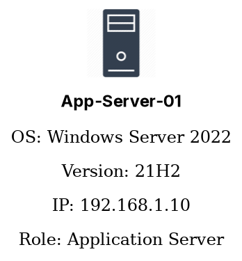
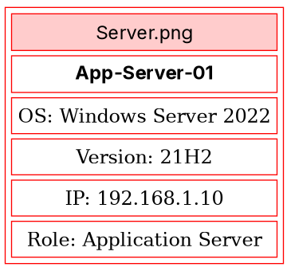
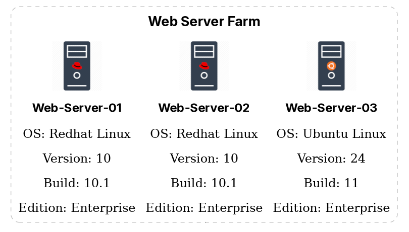
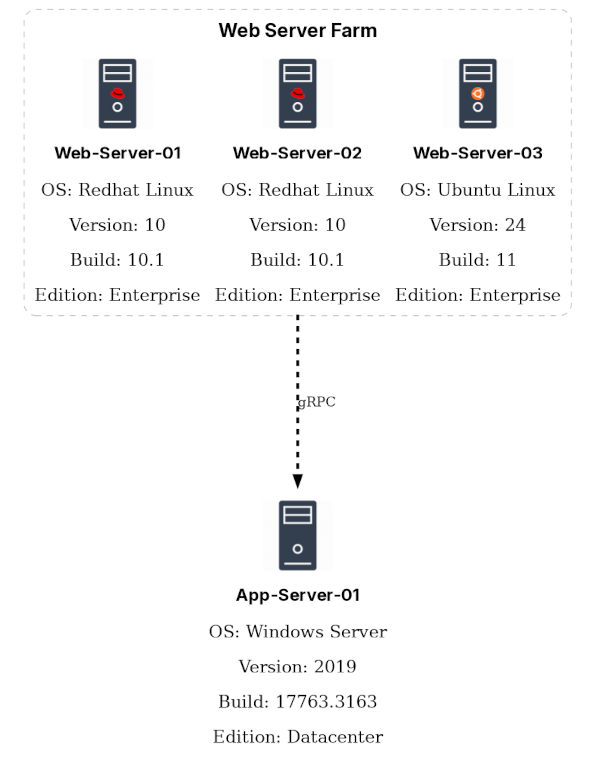
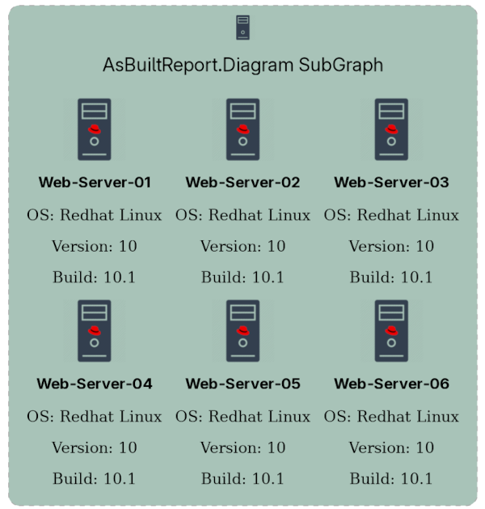
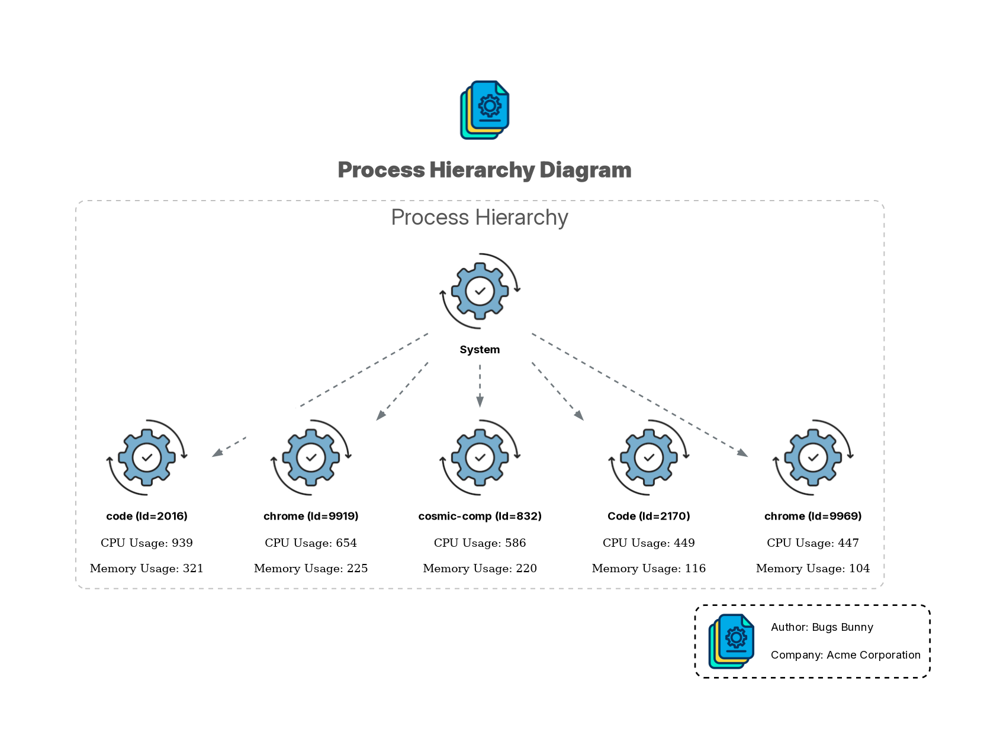
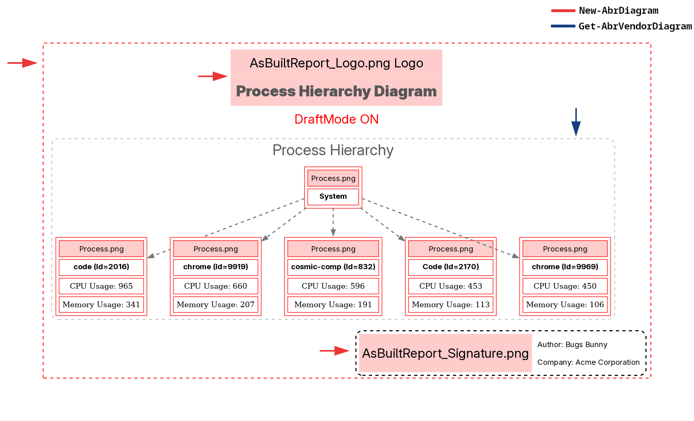

# Adding Diagrams to a Report Module

AsBuiltReport.Diagram is an optional PowerShell module that provides infrastructure diagram generation capabilities for AsBuiltReport report modules. It wraps the [PSGraph](https://github.com/KevinMarquette/PSGraph) module — a PowerShell DSL for [Graphviz](https://graphviz.org/) — and adds icon support, HTML node tables, subgraph containers, watermarks, themed styling, and direct integration with the PScribo document framework.

Diagrams are generated in memory as base64-encoded images and embedded into the report using PScribo's `Image` cmdlet. They can also be exported to disk as standalone files (PNG, SVG, PDF) alongside the report.

!!! info "Prerequisite Reading"
    This guide assumes you are already familiar with creating AsBuiltReport report modules. If not, read the [Creating a Report Module](creating-a-report-module.md) guide first.

!!! tip "Reference Implementation"
    For a complete, production-ready example of diagram implementation, see the [AsBuiltReport.System.Resources](https://github.com/AsBuiltReport/AsBuiltReport.System.Resources) repository. 
    This project includes:

    - `Src/Private/Diagram/Export-AbrDiagram.ps1` — Orchestration function
    - `Src/Private/Diagram/Get-AbrProcessDiagram.ps1` — Diagram builder function
    - `Icons/` directory with 100×150 PNG icon files
    
    This reference implementation demonstrates all patterns discussed in this guide.

## Prerequisites

### System Requirements

- **PowerShell** 5.1 or later (Windows) or PowerShell 7+ (Linux/macOS)
- **PSGraph** module (installs automatically with AsBuiltReport.Diagram)
- **Graphviz** (pre-installed on Windows, requires separate installation on Linux/macOS)

### PSGraph

AsBuiltReport.Diagram requires the PSGraph module. Install it from the PowerShell Gallery:

```powershell title="Install PSGraph"
Install-Module -Name PSGraph -Scope CurrentUser
```

### Graphviz

On **Windows**, Graphviz is bundled with AsBuiltReport.Diagram and requires no separate installation. On **Linux** and **macOS**, install Graphviz using your package manager:

=== "Debian / Ubuntu"
    ```bash
    sudo apt install graphviz
    ```

=== "Fedora / RHEL / CentOS"
    ```bash
    sudo dnf install graphviz
    ```

=== "macOS (Homebrew)"
    ```bash
    brew install graphviz
    ```

=== "macOS (MacPorts)"
    ```bash
    sudo port install graphviz
    ```

## Installation

Install AsBuiltReport.Diagram from the PowerShell Gallery:

```powershell title="Install AsBuiltReport.Diagram"
Install-Module -Name AsBuiltReport.Diagram -Scope CurrentUser
```
## Declaring the Dependency

Add `AsBuiltReport.Diagram` to the `RequiredModules` array in your module manifest (`.psd1`):

```powershell title="Module manifest (.psd1) — RequiredModules"
RequiredModules = @(
    @{
        ModuleName    = 'AsBuiltReport.Core'
        ModuleVersion = '1.6.4'
    }
    @{
        ModuleName    = 'PSGraph'
        ModuleVersion = '2.1.38.27'
    }
    @{
        ModuleName    = 'AsBuiltReport.Diagram'
        ModuleVersion = '1.0.7'
    }
)
```

## JSON Configuration

Diagrams are controlled by `Options` keys in the report JSON configuration file rather than `InfoLevel`, since diagrams represent an optional capability rather than a depth-of-detail setting. Add the following keys to the `Options` section of your module's JSON template:

```json title="Report configuration JSON — Options for diagrams"
{
    "Options": {
        "EnableDiagrams": true,
        "EnableDiagramDebug": false,
        "EnableDiagramMainLogo": false,
        "DiagramTheme": "White",
        "DiagramWaterMark": "",
        "ExportDiagrams": false,
        "ExportDiagramsFormat": [
            "png"
        ],
        "EnableDiagramSignature": false,
        "DiagramColumnSize": 4,
        "SignatureAuthorName": "",
        "SignatureCompanyName": ""
    },
}
```

| Key                      | Type    | Default   | Description                                                                                           |
| ------------------------ | ------- | --------- | ----------------------------------------------------------------------------------------------------- |
| `EnableDiagrams`         | Boolean | `false`   | Embed diagram images in the report                                                                    |
| `ExportDiagrams`         | Boolean | `false`   | Export standalone diagram files alongside the report                                                  |
| `ExportDiagramsFormat`   | Array   | `["png"]` | Standalone export formats: `pdf`, `png`, `svg`, `jpg`                                                 |
| `DiagramTheme`           | String  | `"White"` | Diagram colour theme: `White`, `Black`, or `Neon`                                                     |
| `DiagramWaterMark`       | String  | `""`      | Optional watermark text (e.g. `"CONFIDENTIAL"`)                                                       |
| `EnableDiagramSignature` | Boolean | `false`   | Add footer signature with author and company name                                                     |
| `EnableDiagramDebug`     | Boolean | `false`   | Render diagrams in draft mode (placeholders instead of icons) for faster iteration during development |
| `SignatureAuthorName`    | String  | `""`      | Author name for diagram footer signature (if `EnableDiagramSignature` is `true`)                      |
| `SignatureCompanyName`   | String  | `""`      | Company name for diagram footer signature (if `EnableDiagramSignature` is `true`)                     |
| `EnableDiagramMainLogo`  | Boolean | `false`   | Display main logo in diagrams                                                                         |

## How Diagrams Are Embedded

Diagrams are generated in `base64` format, which returns the diagram as a base64-encoded string rather than writing a file to disk. This string is embedded into the report using PScribo's `Image` cmdlet. When `ExportDiagrams` is enabled, the diagram is also saved to disk in the requested format(s) **before** the base64 pass.

The `Get-BestImageAspectRatio` function (provided by AsBuiltReport.Diagram) calculates the optimal width and height to fit the diagram within your target bounds while preserving the original aspect ratio.

### Diagram Generation Flow

The diagram generation follows this sequence:

1. **Collect infrastructure data** — Gather system information (processes, servers, networks, etc.)
2. **Build PSGraph structure** — Assemble nodes, edges, and subgraphs using the PSGraph DSL
3. **Export standalone files** (if enabled) — Call `New-AbrDiagram` with file formats (`pdf`, `png`, `svg`)
4. **Generate base64 for embedding** — Call `New-AbrDiagram` again with `-Format base64` for the report

```powershell title="Core diagram embedding pattern"
try {
    $DiagramObj = Get-AbrInfrastructureDiagram -Format base64 -Direction $Options.DiagramDirection -DraftMode:$Options.EnableDiagramDebug
    $Diagram = New-AbrDiagram @DiagramParams -InputObject $Graph
    if ($Diagram) {
        $BestAspectRatio = Get-BestImageAspectRatio -GraphObj $Diagram -MaxWidth 600 -MaxHeight 600
        PageBreak
        Section -Style Heading3 $MainDiagramLabel {
            Image -Base64 $Diagram -Text "$MainDiagramLabel Diagram" -Width $BestAspectRatio.Width -Height $BestAspectRatio.Height -Align Center
        }
    }
} catch {
    Write-PScriboMessage -IsWarning -Message "Unable to generate the $MainDiagramLabel Diagram: $($_.Exception.Message)"
}
```

!!! important "Export Diagrams Pattern"
    When `ExportDiagrams` is enabled, `New-AbrDiagram` is called **twice**: once with file formats to export to disk, then again with `-Format base64` to embed in the report. This allows both standalone exports and report embedding in a single orchestration function.

!!! note
    `PageBreak` is called before the diagram `Section`, so the diagram occupies its own page in Word output. Omit `PageBreak` if you prefer the diagram to flow inline with surrounding content.

## Repository Structure for Diagrams

Diagram functions are kept in a dedicated subfolder under `Src/Private/` to separate diagram-generation code from report-section code:

```text title="Recommended folder structure for diagram files"
AsBuiltReport.Vendor.Technology/
└── Src/
    ├── Private/
    │   ├── Diagram/
    │   │   ├── Export-AbrDiagram.ps1          # Diagram orchestration & export function
    │   │   └── Get-Abr[Vendor]Diagram.ps1     # PSGraph node/edge assembly
    │   └── Get-Abr[VendorAbr][Resource].ps1   # Report section functions
    └── Public/
        └── Invoke-AsBuiltReport.Vendor.Technology.ps1
```

### Separation of Concerns

- **`Get-AbrVendorDiagram.ps1`** — Builds the PSGraph structure (`SubGraph`, `nodes`, `edges`). Returns the graph object.
- **`Export-AbrDiagram.ps1`** — Orchestration function. Takes the graph object, applies theme/formatting, handles file export, and returns base64 for embedding.

This separation allows each function to have a single responsibility: the diagram builder focuses on data collection and graph topology, while the export function handles rendering configuration and output formats. See the [AsBuiltReport.System.Resources repository](https://github.com/AsBuiltReport/AsBuiltReport.System.Resources) for a complete production-ready reference.

## Building a Diagram

### Icon Mapping

Diagrams use PNG icons to represent infrastructure components. Define a `$script:Images` hashtable that maps semantic names to icon filenames. The icon files must exist in the path passed to `New-AbrDiagram` via `-IconPath`.

```powershell title="Define the icon mapping hashtable"
$script:Images = @{
    'AsBuiltReport_LOGO' = 'AsBuiltReport_Logo.png'
    'AsBuiltReport_Signature' = 'AsBuiltReport_Signature.png'
    'Abr_LOGO_Footer' = 'AsBuiltReport.png'
    'Process' = 'Process.png'
}
```

Using `$script:` scope makes the hashtable available to all private diagram functions called from the main diagram assembly without passing it as a parameter.

### Graph Structure

PSGraph uses scriptblocks to define the diagram hierarchy. Node and edge default attributes — shape, font, colour — are declared once at the top of the `Graph {}` block and inherited by all nodes and edges unless overridden.

!!! note
    `New-AbrDiagram` handles the Graph section internally, so you only need to build the inner structure (nodes, edges, subgraphs) in your diagram builder function. The orchestration function will pass the resulting graph object to `New-AbrDiagram` for rendering. This section is for demonstration purposes to show how to set graph-level defaults.

```powershell title="Graph with node and edge defaults"
$DiagramGraph = Graph -Name 'VendorTechnology' -Attributes @{
    pad        = 1.0
    rankdir    = 'TB'          # TB = top-to-bottom; LR = left-to-right
    splines    = 'polyline'
    penwidth   = 1.5
    fontname   = 'Segoe Ui Black'
    fontcolor  = '#565656'
    fontsize   = 32
    style      = 'dashed'
    labelloc   = 't'
    imagepath  = $IconPath
    nodesep    = 0.60
    ranksep    = 0.75
    bgcolor    = 'White'
} {
    # Default attributes for all nodes
    Node @{
        shape     = 'none'
        labelloc  = 't'
        style     = 'filled'
        fillColor = 'transparent'
        fontsize  = 14
        imagescale = $true
    }

    # Default attributes for all edges
    Edge @{
        style     = 'dashed'
        dir       = 'both'
        arrowtail = 'dot'
        color     = '#71797E'
        penwidth  = 2
        arrowsize = 1
    }

    SubGraph MainGraph -Attributes @{
        Label   = ''
        penwidth = 0
        bgcolor = 'transparent'
    } {
        # Nodes and edges go here
    }
}
```

### Adding Individual Nodes

Use `Add-NodeIcon` to create a node with an icon and optional metadata table beneath it.

```powershell title="Adding a node with an icon"
$ServerInfo = [PSCustomObject][ordered]@{
    'OS'      = 'Windows Server 2022'
    'Version' = '21H2'
    'IP'      = '192.168.1.10'
    'Role'    = 'Application Server'
}

Add-NodeIcon `
    -Name 'App-Server-01' `
    -IconType 'Server' `
    -AditionalInfo $ServerInfo `
    -ImagesObj $script:Images `
    -Align 'Center' `
    -FontSize 16 `
    -DraftMode:$DraftMode
    -NodeObject
```
##### Example of a Node with an Icon



The `-DraftMode` switch renders placeholder boxes instead of real icons during development, making it faster to iterate on layout without needing all icon files in place.
    
##### Example of a Node in Draft Mode


### Adding Server Farms and Collections

Use `Add-HtmlNodeTable` when you want to display a group of similar objects (e.g. a proxy server farm, a repository list) in a multi-column grid with a subgraph border around them.

```powershell title="Adding a server farm with Add-HtmlNodeTable"
$ProxyServers = @(
    @{
        Name           = 'proxy-01.example.com'
        AdditionalInfo = [PSCustomObject][ordered]@{
            'OS'   = 'Windows Server 2022'
            'Mode' = 'Automatic'
            'IP'   = '192.168.1.20'
        }
    },
    @{
        Name           = 'proxy-02.example.com'
        AdditionalInfo = [PSCustomObject][ordered]@{
            'OS'   = 'Windows Server 2022'
            'Mode' = 'Manual'
            'IP'   = '192.168.1.21'
        }
    }
)

Add-HtmlNodeTable `
    -Name 'ProxyFarm' `
    -ImagesObj $script:Images `
    -InputObject $ProxyServers.Name `
    -IconType 'Server' `
    -ColumnSize 3 `
    -AditionalInfo $ProxyServers.AdditionalInfo `
    -Subgraph `
    -SubgraphLabel 'Proxy Servers' `
    -SubgraphLabelPos 'top' `
    -SubgraphTableStyle 'dashed,rounded' `
    -TableBorderColor '#71797E' `
    -TableBorder '1' `
    -SubgraphLabelFontSize 18 `
    -FontSize 14 `
    -FontBold `
    -SubgraphFontBold `
    -DraftMode:$DraftMode `
    -NodeObject
```
##### Example of a Server Farm Node


### Connecting Nodes

Use `Add-NodeEdge` to draw labelled connections between nodes:

```powershell title="Connecting nodes with Add-NodeEdge"
Add-NodeEdge `
    -From 'AppServer01' `
    -To 'ProxyFarm' `
    -EdgeLabel 'HTTPS' `
    -EdgeColor '#71797E' `
    -EdgeLabelFontSize 12 `
    -EdgeLabelFontColor '#565656'
```
##### Example of Connected Nodes


### Controlling Layout

Use `Rank` to force nodes onto the same horizontal level:

```powershell title="Aligning nodes to the same rank"
# Force all proxy nodes to render at the same vertical position
Rank 'proxy-01.example.com', 'proxy-02.example.com', 'proxy-03.example.com'
```

### Grouping with SubGraph

Use `Add-HtmlSubGraph` group related nodes together under a shared border and label. This is ideal for server farms, application tiers, or any logical grouping of components. The subgraph acts as a container that visually separates its child nodes from the rest of the diagram.

```powershell title="Grouping nodes in a Add-HtmlSubGraph"
$WebServerFarm = @(
    @{
        Name = 'Web-Server-01';
        AdditionalInfo = [PSCustomObject][ordered]@{
            'OS' = 'Redhat Linux'
            'Version' = '10'
            'Build' = '10.1'
        }
        IconType = 'ServerRedhat'
    },
    @{
        Name = 'Web-Server-02';
        AdditionalInfo = [PSCustomObject][ordered]@{
            'OS' = 'Redhat Linux'
            'Version' = '10'
            'Build' = '10.1'
        }
        IconType = 'ServerRedhat'
    },
    @{
        Name = 'Web-Server-03';
        AdditionalInfo = [PSCustomObject][ordered]@{
            'OS' = 'Redhat Linux'
            'Version' = '10'
            'Build' = '10.1'
        }
        IconType = 'ServerRedhat'
    },
    @{
        Name = 'Web-Server-04';
        AdditionalInfo = [PSCustomObject][ordered]@{
            'OS' = 'Redhat Linux'
            'Version' = '10'
            'Build' = '10.1'
        }
        IconType = 'ServerRedhat'
    }, @{
        Name = 'Web-Server-05';
        AdditionalInfo = [PSCustomObject][ordered]@{
            'OS' = 'Redhat Linux'
            'Version' = '10'
            'Build' = '10.1'
        }
        IconType = 'ServerRedhat'
    },
    @{
        Name = 'Web-Server-06';
        AdditionalInfo = [PSCustomObject][ordered]@{
            'OS' = 'Redhat Linux'
            'Version' = '10'
            'Build' = '10.1'
        }
        IconType = 'ServerRedhat'
    }
)

$WebLabel = Add-HtmlNodeTable -Name 'WebLabel' -ImagesObj $Images -inputObject $WebServerFarm.Name -iconType $WebServerFarm.IconType -ColumnSize 3 -AditionalInfo $WebServerFarm.AdditionalInfo -MultiIcon -DraftMode:$DraftMode -FontSize 18 -TableBackgroundColor '#a8c3b8ff' -CellBackgroundColor '#a8c3b8ff'

Add-HtmlSubGraph -Name 'USA-WebServers' -ImagesObj $Images -TableArray $WebLabel -Align 'Center' -Label 'AsBuiltReport.Diagram SubGraph' -LabelPos 'top' -TableStyle 'dashed,rounded' -TableBorderColor 'darkgray' -TableBorder '1' -ColumnSize 1 -FontSize 22 -DraftMode:$DraftMode -TableBackgroundColor '#a8c3b8ff' -IconType 'Server' -NodeObject

```
###### Example of a SubGraph Grouping Multiple Nodes


## Generating the Diagram

Once the PSGraph structure is assembled, pass it to `New-AbrDiagram` to render the output:

```powershell title="Calling New-AbrDiagram"
New-AbrDiagram `
    -InputObject $DiagramGraph `
    -OutputFolderPath $OutputFolderPath `
    -Filename 'VendorTechnology-Infrastructure' `
    -Format @('base64') `
    -MainDiagramLabel 'Vendor Technology Infrastructure' `
    -IconPath $IconPath `
    -ImagesObj $script:Images `
    -LogoName 'Main_Logo' `
    -Direction 'top-to-bottom' `
    -MainGraphBGColor $MainGraphBGColor `
    -Fontcolor $Fontcolor `
    -Fontname 'Segoe Ui Black'
```

To also export standalone files alongside the base64 output, pass additional formats:

```powershell title="Generating base64 and standalone export files"
New-AbrDiagram `
    -InputObject $DiagramGraph `
    -OutputFolderPath $OutputFolderPath `
    -Filename 'VendorTechnology-Infrastructure' `
    -Format @('base64', 'pdf', 'png') `
    -MainDiagramLabel 'Vendor Technology Infrastructure' `
    -IconPath $IconPath `
    -ImagesObj $script:Images `
    -LogoName 'Main_Logo'
```

##### Example of a Generated Diagram


## Diagram Themes

AsBuiltReport.Diagram supports three built-in colour themes. Themes control the visual appearance of diagrams and should be applied consistently throughout your diagram functions.

### Theme Application

Define theme colours in the `begin` block of your diagram builder function, then use those variables throughout the graph assembly. This ensures theme changes propagate consistently:

```powershell title="Applying a diagram theme in the diagram builder"
if ($Options.DiagramTheme -eq 'Black') {
    $Edgecolor = 'White'
    $Fontcolor = 'White'
    $NodeFontcolor = 'White'
} elseif ($Options.DiagramTheme -eq 'Neon') {
    $Edgecolor = 'gold2'
    $Fontcolor = 'gold2'
    $NodeFontcolor = 'gold2'
} else {
    # White theme (default)
    $Edgecolor = '#71797E'
    $Fontcolor = '#565656'
    $NodeFontcolor = '#565656'
}
```

### Theme Usage in New-AbrDiagram

The orchestration function (`Export-AbrDiagram`) applies additional theme-specific parameters to `New-AbrDiagram`:

```powershell title="Applying theme colours in the orchestration function"
switch ($Options.DiagramTheme) {
    'Black' {
        $DiagramParams.add('MainGraphBGColor', 'Black')
        $DiagramParams.add('Edgecolor', 'White')
        $DiagramParams.add('Fontcolor', 'White')
        $DiagramParams.add('NodeFontcolor', 'White')
        $DiagramParams.add('WaterMarkColor', 'White')
    }
    'Neon' {
        $DiagramParams.add('MainGraphBGColor', 'grey14')
        $DiagramParams.add('Edgecolor', 'gold2')
        $DiagramParams.add('Fontcolor', 'gold2')
        $DiagramParams.add('NodeFontcolor', 'gold2')
        $DiagramParams.add('WaterMarkColor', '#FFD700')
    }
    default {
        $DiagramParams.add('WaterMarkColor', '#333333')
    }
}
```

### Theme Details

| Theme     | Background         | Font Color          | Edge Color          | Use Case                                 |
| --------- | ------------------ | ------------------- | ------------------- | ---------------------------------------- |
| **White** | White              | Dark grey (#565656) | Dark grey (#71797E) | Default; works well in printed documents |
| **Black** | Black              | White               | White               | Dark mode; suitable for presentations    |
| **Neon**  | Dark grey (grey14) | Gold (gold2)        | Gold (gold2)        | High contrast; good for visibility       |

## Watermarks and Signatures

`New-AbrDiagram` supports optional watermarks and footer signatures:

```powershell title="Watermark and signature parameters"
New-AbrDiagram `
    -InputObject $DiagramGraph `
    -Format @('png') `
    -OutputFolderPath $OutputFolderPath `
    # Watermark
    -WaterMarkText $Options.DiagramWaterMark `
    -WaterMarkColor 'Gray' `
    -WaterMarkFontOpacity 0.3 `
    # Footer signature
    -Signature `
    -AuthorName 'Tim Carman' `
    -CompanyName 'Contoso'
```

## Complete Private Function Example

### Reference Implementation Source

The example functions below are from the [AsBuiltReport.System.Resources](https://github.com/AsBuiltReport/AsBuiltReport.System.Resources) repository. These are production-ready implementations that demonstrate all the patterns and best practices discussed in this guide.

**View the full source code:**

- [Export-AbrDiagram.ps1](https://github.com/AsBuiltReport/AsBuiltReport.System.Resources/blob/dev/AsBuiltReport.System.Resources/Src/Private/Export-AbrDiagram.ps1)
- [Get-AbrProcessDiagram.ps1](https://github.com/AsBuiltReport/AsBuiltReport.System.Resources/blob/dev/AsBuiltReport.System.Resources/Src/Private/Diagram/Get-AbrProcessDiagram.ps1)

### 1. Diagram Builder Function (Get-AbrProcessDiagram)

The diagram builder function collects infrastructure data and assembles the PSGraph structure. It reads from script-scoped variables (`$Options`, `$reportTranslate`, `$Images`) set by the AsBuiltReport framework.

Key responsibilities:

* Collect data from the target system
* Apply theme-specific colours
* Build nodes and edges
* Handle debug styling
* Return the PSGraph object

```powershell title="Src/Private/Diagram/Get-AbrProcessDiagram.ps1"
function Get-AbrProcessDiagram {
    <#
    .SYNOPSIS
        Used by As Built Report to build a process hierarchy diagram.
    .DESCRIPTION
        Builds a Graphviz-based process hierarchy diagram showing the top 5 CPU-consuming
        processes and their relationship to the host system. The diagram is constructed using
        the AsBuiltReport.Diagram module's PSGraph DSL (SubGraph, Add-DiaNodeIcon, Edge).

        The diagram structure:
            - A single SubGraph named 'ProcessH' acts as the cluster container.
            - A 'System' node represents the host machine.
            - Five process nodes (one per top-5 process) show CPU and Memory usage as
              additional node attributes.
            - Dashed edges connect the 'System' node to each process node.

        Colour and style are determined by the DiagramTheme option:
            Black  - Dark background, white labels and edges.
            Neon   - Dark grey background, gold labels and edges.
            White  - Default; light-coloured edges and labels.

        When EnableDiagramDebug is true, debug styling (red dashed borders, visible edges)
        is applied to all graph elements to help troubleshoot layout issues.

        This function returns the resulting Graphviz graph object, which is then passed to
        Export-AbrDiagram for rendering and embedding into the report.
    .INPUTS
        None. This function does not accept pipeline input. It reads from script-scoped
        variables ($Options, $reportTranslate, $Images) that are set by the AsBuiltReport
        framework before this function is called.
    .OUTPUTS
        System.Object
        Returns the Graphviz SubGraph object produced by the PSGraph DSL. The caller
        (Get-AbrProcessInfo) passes this object to Export-AbrDiagram for rendering.
    .EXAMPLE
        # This function is called automatically by Get-AbrProcessInfo.
        # It is not designed to be called directly by end users.
        $diagram = Get-AbrProcessDiagram
        Export-AbrDiagram -DiagramObject $diagram -MainDiagramLabel 'Process Hierarchy Diagram' -FileName 'ProcessDiagram'
    .NOTES
        Version:        0.1.3
        Author:         AsBuiltReport Community
        Twitter:        @AsBuiltReport
        Github:         AsBuiltReport
    .LINK
        https://github.com/AsBuiltReport/AsBuiltReport.System.Resources
    #>
    [CmdletBinding()]
    param (
    )

    begin {
        Write-PScriboMessage ($($reportTranslate.InfoLevel) -f 'ProcessInfo', $($InfoLevel.ProcessInfo))
        Write-PScriboMessage $($reportTranslate.Generating)
        # Configure debug styling when EnableDiagramDebug is enabled. In debug mode, edges and
        # subgraph borders are drawn in red so layout issues are easy to spot. In normal mode,
        # these elements are made invisible (style = 'invis') so they do not appear in the
        # final diagram output.
        if ($Options.EnableDiagramDebug) {
            $EdgeDebug = @{style = 'filled'; color = 'red' }
            $SubGraphDebug = @{style = 'dashed'; color = 'red' }
            $NodeDebug = @{color = 'black'; style = 'red'; shape = 'plain' }
            $NodeDebugEdge = @{color = 'black'; style = 'red'; shape = 'plain' }
            $IconDebug = $true
        } else {
            $EdgeDebug = @{style = 'invis'; color = 'red' }
            $SubGraphDebug = @{style = 'invis'; color = 'gray' }
            $NodeDebug = @{color = 'transparent'; style = 'transparent'; shape = 'point' }
            $NodeDebugEdge = @{color = 'transparent'; style = 'transparent'; shape = 'none' }
            $IconDebug = $false
        }

        # Set the edge and font colours based on the chosen diagram theme.
        if ($Options.DiagramTheme -eq 'Black') {
            $Edgecolor = 'White'
            $Fontcolor = 'White'
        } elseif ($Options.DiagramTheme -eq 'Neon') {
            $Edgecolor = 'gold2'
            $Fontcolor = 'gold2'
        } else {
            $Edgecolor = '#71797E'
            $Fontcolor = '#565656'
        }
    }

    process {
        try {
            # Retrieve the top 5 CPU-consuming processes and project the properties needed for
            # diagram node labels. CPU time is rounded to whole seconds; memory is in MB.
            $Process = Get-Process | Sort-Object -Property CPU -Descending | Select-Object -Property @{Name = 'Name'; Expression = { "$($_.Name.Split(' ')[0]) (Id=$($_.Id))" } }, @{Name = 'CPU'; Expression = { try { [math]::Round($_.CPU, 0) } catch { '--' } } }, @{Name = 'MEM'; Expression = { try { [math]::Round($_.WorkingSet / 1MB, 0) } catch { '--' } } } -First 5

            # SubGraph is a Graphviz element that groups related nodes inside a bordered cluster.
            # Here the cluster contains the System node and the top 5 process nodes.
            # Attributes control the cluster border style, label, font, and colour.
            SubGraph ProcessH -Attributes @{Label = $($reportTranslate.Label); fontsize = 28; fontcolor = $Fontcolor; penwidth = 1.5; labelloc = 't'; style = 'dashed,rounded'; color = 'gray' } {

                # Add the System node to the diagram. Add-DiaNodeIcon is a helper from the
                # AsBuiltReport.Diagram module that renders a node with an icon image sourced
                # from the $Images hashtable.
                Add-NodeIcon -Name 'System' -IconDebug $IconDebug -IconType 'Process' -ImagesObj $Images -NodeObject

                # Add one node per top-5 process. Each node shows the process name (including PID)
                # as well as additional info attributes for CPU and Memory usage.
                $Process | ForEach-Object { Add-NodeIcon -Name $_.Name -IconDebug $IconDebug -IconType 'Process' -ImagesObj $Images -NodeObject -AditionalInfo @{'CPU Usage' = $_.CPU; 'Memory Usage' = $_.MEM } }

                # Draw a dashed edge from the System node to each process node to represent the
                # parent-child relationship. Edge colour and width follow the active theme.
                $Process | ForEach-Object { Add-NodeEdge -From 'System' -To $_.Name -EdgeStyle 'dashed' -EdgeColor $Edgecolor -EdgeThickness 2 }
            }
        } catch {
            Write-PScriboMessage -IsWarning $_.Exception.Message
        }
    }

    end {}
}
```

### 2. Diagram Orchestration Function (Export-AbrDiagram)

The orchestration function handles rendering configuration, theme application, file export, and report embedding. This function acts as the integration point between the diagram builder and the report generation framework.

Key responsibilities:

* Apply theme-specific colours and styles
* Configure icon path resolution
* Handle file export when enabled
* Generate base64 for report embedding
* Manage watermarks and signatures
* Provide error handling and logging

The orchestration function reads these `$Options` keys:

| Option                   | Type    | Purpose                                                |
| ------------------------ | ------- | ------------------------------------------------------ |
| `EnableDiagrams`         | Boolean | Master switch; when false, function exits immediately  |
| `DiagramTheme`           | String  | 'White', 'Black', or 'Neon' for color scheme           |
| `ExportDiagrams`         | Boolean | Save diagram files to disk                             |
| `ExportDiagramsFormat`   | Array   | Formats to export: `['png']`, `['pdf', 'svg']`, etc.   |
| `EnableDiagramDebug`     | Boolean | Render with debug styling (red borders, visible edges) |
| `EnableDiagramSignature` | Boolean | Add author/company footer                              |
| `SignatureAuthorName`    | String  | Author name for signature                              |
| `SignatureCompanyName`   | String  | Company name for signature                             |
| `EnableDiagramMainLogo`  | Boolean | Show main logo in diagram                              |
| `DiagramWaterMark`       | String  | Text watermark to overlay                              |

**Export Flow with Format Handling:**

When `ExportDiagrams` is true:

1. Build the `$DiagramParams` hashtable with theme colours
2. Add the requested export formats to `$DiagramParams['Format']`
3. Call `New-AbrDiagram` to export files to `$OutputFolderPath`
4. Remove the format from `$DiagramParams` and set it to `'base64'`
5. Call `New-AbrDiagram` again to generate base64 for embedding

```powershell title="Export-AbrDiagram pattern for dual output (file + embedded)"
# First pass: export to disk (if enabled)
if ($Options.ExportDiagrams) {
    if (-not $Options.ExportDiagramsFormat) {
        $DiagramFormat = 'png'
    } else {
        $DiagramFormat = $Options.ExportDiagramsFormat
    }
    $DiagramParams.Add('Format', $DiagramFormat)
    
    try {
        $Graph = $DiagramObject
        $Diagram = New-AbrDiagram @DiagramParams -InputObject $Graph
        if ($Diagram) {
            foreach ($OutputFormat in $DiagramFormat) {
                Write-Information -MessageData "Saved '$($FileName).$($OutputFormat)' to '$($OutputFolderPath)'" -InformationAction Continue
            }
        }
    } catch {
        Write-PScriboMessage -IsWarning "Unable to export diagram: $($_.Exception.Message)"
    }
}

# Second pass: always render as base64 for embedding
try {
    $DiagramParams.Remove('Format')
    $DiagramParams.Add('Format', 'base64')
    
    $Graph = $DiagramObject
    $Diagram = New-AbrDiagram @DiagramParams -InputObject $Graph
    if ($Diagram) {
        $BestAspectRatio = Get-BestImageAspectRatio -GraphObj $Diagram -MaxWidth 600 -MaxHeight 600
        PageBreak
        Section -Style Heading3 $MainDiagramLabel {
            Image -Base64 $Diagram -Text "$MainDiagramLabel Diagram" -Width $BestAspectRatio.Width -Height $BestAspectRatio.Height -Align Center
        }
    }
} catch {
    Write-PScriboMessage -IsWarning "Unable to generate diagram: $($_.Exception.Message)"
}
```

!!! important "Two-Pass Rendering Pattern"
    This dual-pass approach (export first, then base64) ensures:

    - **Consistency**: Same rendering engine for both outputs
    - **Efficiency**: Graphviz rendering is only done once per format
    - **Flexibility**: Users can export standalone files *and* embed in reports simultaneously

### Integrating with Report Section Functions

Diagram builder functions are called from report section functions (e.g., `Get-AbrProcessInfo`). The report section function calls `Export-AbrDiagram` to handle rendering:

```powershell title="Pattern: Report Section Calls Export-AbrDiagram"
function Get-AbrProcessInfo {
    # ... gather process data and system information ...
    
    # Build the diagram structure
    $diagram = Get-AbrProcessDiagram
    
    # Export and embed the diagram in the report
    Export-AbrDiagram -DiagramObject $diagram `
                      -MainDiagramLabel 'Process Hierarchy' `
                      -FileName 'ProcessHierarchy'
}
```

In your main `Invoke-AsBuiltReport.*` function, call the diagram function and embed the result immediately before the main report sections:

```powershell title="Embedding a diagram in the main report function"
foreach ($System in $Target) {
    try {
        $script:Connection = Connect-VendorSystem -Server $System -Credential $Credential -ErrorAction Stop
        $script:OutputFolderPath = $OutputFolderPath

        Section -Style Heading1 $System {
            # Diagram section (before all data sections)
            if ($Options.EnableDiagrams) {
                try {
                    # Get the diagram structure from the builder function
                    $diagram = Get-AbrProcessDiagram
                    
                    # Call Export-AbrDiagram to handle rendering and embedding
                    Export-AbrDiagram -DiagramObject $diagram `
                                      -MainDiagramLabel 'Process Hierarchy Diagram' `
                                      -FileName 'ProcessHierarchy'
                } catch {
                    Write-PScriboMessage -IsWarning "Process Diagram: $($_.Exception.Message)"
                }
            }

            # Data sections follow
            Get-AbrProcessInfo
            Get-AbrSystemInfo
        }
    } catch {
        Write-PScriboMessage -IsWarning ($LocalizedData.ConnectionError -f $System, $_.Exception.Message)
    }
}
```

## Script-Scoped Variables

Diagram builder functions read from script-scoped variables set by the AsBuiltReport framework and report section functions. These variables must be set before calling the diagram builder:

| Variable                   | Type           | Set By                | Purpose                                             |
| -------------------------- | -------------- | --------------------- | --------------------------------------------------- |
| `$script:Options`          | PSCustomObject | Report config         | Diagram configuration (themes, export, debug, etc.) |
| `$script:OutputFolderPath` | String         | Main function         | Directory for file exports                          |
| `$script:Images`           | Hashtable      | Module initialization | Maps semantic icon names to filenames               |
| `$script:reportTranslate`  | PSCustomObject | Framework             | Localized strings                                   |
| `$script:Connection`       | Object         | Main function         | Connection to target system                         |
| `$script:InfoLevel`        | PSCustomObject | Framework             | Detail level for each section                       |

**Example: Setting script-scoped variables in the main function**

```powershell title="Setting script-scoped context for diagram functions"
function Invoke-AsBuiltReportVendorTechnology {
    param (
        [String[]] $Target,
        [PSCredential] $Credential,
        [String] $OutputFolderPath = (Get-Location).Path
    )
    
    # Initialize the Images hashtable
    $script:Images = @{
        'AsBuiltReport_LOGO' = 'AsBuiltReport_Logo.png'
        'AsBuiltReport_Signature' = 'AsBuiltReport_Signature.png'
        'Process' = 'Process.png'
        'Server' = 'Server.png'
    }
    
    # Set the output folder for exports
    $script:OutputFolderPath = $OutputFolderPath
    
    foreach ($System in $Target) {
        # Connect and set connection variable
        $script:Connection = Connect-VendorSystem -Server $System -Credential $Credential
        
        # Now diagram functions can read $script:Connection, $script:Options, $script:OutputFolderPath, $script:Images
    }
}
```

## Localising Diagram Section Titles

Store diagram section headings and `Image` alt-text in your module's language file alongside other translated strings:

```powershell title="Language file entries for diagram sections (en-US)"
InvokeAsBuiltReportVendorTechnology = ConvertFrom-StringData @'
    Connecting                    = Connecting to {0}.
    ConnectionError               = Failed to connect to {0}: {1}
    InfrastructureDiagram         = Infrastructure Diagram
    InfrastructureDiagramAltText  = Vendor Technology infrastructure topology diagram
    NetworkDiagram                = Network Diagram
    NetworkDiagramAltText         = Vendor Technology network topology diagram
'@
```

```powershell title="Using $LocalizedData for diagram section titles"
if ($Options.EnableDiagrams -and $Graph) {
    Section -Style Heading2 $LocalizedData.InfrastructureDiagram {
        Image -Base64 $Graph `
              -Text $LocalizedData.InfrastructureDiagramAltText `
              -Align Center `
              -Width $BestAspectRatio.Width `
              -Height $BestAspectRatio.Height
        PageBreak
    }
}
```

## What is handled by New-AbrDiagram

The `New-AbrDiagram` handles the Main logo, label, watermark and signature rendering, as well as applying theme colours and exporting to multiple formats. This allows your diagram builder function to focus solely on assembling the PSGraph structure (nodes, edges, subgraphs) without needing to manage rendering details.



## Reference Implementations

For additional guidance and working examples, refer to the following production-ready repositories:

### AsBuiltReport.System.Resources

The [AsBuiltReport.System.Resources](https://github.com/AsBuiltReport/AsBuiltReport.System.Resources) repository is the primary reference implementation for diagram functionality.

**Key Files:**

1. [`Src/Private/Diagram/Export-AbrDiagram.ps1`](https://github.com/AsBuiltReport/AsBuiltReport.System.Resources/blob/dev/AsBuiltReport.System.Resources/Src/Private/Export-AbrDiagram.ps1)

     - Complete orchestration function
     - Dual-pass rendering implementation
     - Theme application pattern
     - File export handling

2. [`Src/Private/Diagram/Get-AbrProcessDiagram.ps1`](https://github.com/AsBuiltReport/AsBuiltReport.System.Resources/blob/dev/AsBuiltReport.System.Resources/Src/Private/Diagram/Get-AbrProcessDiagram.ps1)
  
     - Diagram builder function
     - Data collection and assembly
     - Theme color handling
     - Debug mode styling

**What to Study:**

- How themes are applied at both the builder and orchestration layers
- Icon path resolution from module root
- Two-pass rendering for export + embedding
- Error handling with graceful degradation
- Script-scoped variable usage
- SubGraph grouping and node creation

**Directory Structure:**
```
AsBuiltReport.System.Resources/
├── Icons/                           # 100×150 PNG files
│   ├── Process.png
│   ├── AsBuiltReport_Logo.png
│   └── AsBuiltReport_Signature.png
├── Src/
│   ├── Private/
│   │   ├── Diagram/
│   │   │   ├── Export-AbrDiagram.ps1
│   │   │   └── Get-AbrProcessDiagram.ps1
│   │   ├── Get-AbrProcessInfo.ps1
│   │   └── ...
│   └── Public/
│       └── Invoke-AsBuiltReport.ps1
└── AsBuiltReport.System.Resources.psd1
```

### Getting Started with Reference Code

1. **Clone the repository:**
   ```bash
   git clone https://github.com/AsBuiltReport/AsBuiltReport.System.Resources.git
   cd AsBuiltReport.System.Resources
   git checkout dev  # Switch to dev branch for latest features
   ```

2. **Study the diagram functions:**
   
      - Open `Src/Private/Diagram/Get-AbrProcessDiagram.ps1` to understand diagram assembly
      - Open `Src/Private/Diagram/Export-AbrDiagram.ps1` to understand orchestration
      - Compare against the examples in this guide

3. **Review the Icons directory:**

      - Examine icon sizes and formats
      - Note the naming convention for icon files
      - See how the `$Images` hashtable maps names to filenames

4. **Trace the calling pattern:**

      - Find where `Get-AbrProcessDiagram` is called
      - Follow how `Export-AbrDiagram` is invoked
      - Understand how `$script:` variables are initialized

5. **Adapt the patterns to your module:**

      - Create your own `Get-AbrYourModuleDiagram.ps1` function
      - Adapt `Export-AbrDiagram.ps1` for your specific needs
      - Collect your own icons or use the same set

## Common Parameters Reference

### New-AbrDiagram

| Parameter               | Type           | Description                                                 |
| ----------------------- | -------------- | ----------------------------------------------------------- |
| `-InputObject`          | PSGraph object | The assembled `Graph {}` scriptblock result                 |
| `-Format`               | String[]       | Output formats: `pdf`, `svg`, `png`, `jpg`, `dot`, `base64` |
| `-OutputFolderPath`     | DirectoryInfo  | Folder for file-based output formats                        |
| `-Filename`             | String         | Base filename (without extension)                           |
| `-MainDiagramLabel`     | String         | Title displayed at the top of the diagram                   |
| `-IconPath`             | String         | Directory containing icon PNG files                         |
| `-ImagesObj`            | Hashtable      | Maps icon names to filenames in `-IconPath`                 |
| `-LogoName`             | String         | Key from `-ImagesObj` to use as the header logo             |
| `-Direction`            | String         | `top-to-bottom` or `left-to-right`                          |
| `-MainGraphBGColor`     | String         | Background colour (named or hex)                            |
| `-Fontcolor`            | String         | Default font colour                                         |
| `-Fontname`             | String         | Font family (e.g. `Segoe Ui Black`)                         |
| `-WaterMarkText`        | String         | Watermark text                                              |
| `-WaterMarkColor`       | String         | Watermark colour                                            |
| `-WaterMarkFontOpacity` | Double         | Watermark opacity (0.0–1.0)                                 |
| `-Signature`            | Switch         | Add footer signature                                        |
| `-AuthorName`           | String         | Signature author name                                       |
| `-CompanyName`          | String         | Signature company name                                      |
| `-DraftMode`            | Switch         | Render placeholder boxes instead of icons                   |

### Add-NodeIcon

| Parameter        | Type           | Description                               |
| ---------------- | -------------- | ----------------------------------------- |
| `-Name`          | String         | Display label for the node                |
| `-IconType`      | String         | Key from `-ImagesObj` for the icon        |
| `-ImagesObj`     | Hashtable      | Icon name-to-filename mapping             |
| `-AditionalInfo` | PSCustomObject | Properties to display below the icon      |
| `-Align`         | String         | Text alignment: `Left`, `Center`, `Right` |
| `-FontSize`      | Int            | Label font size                           |
| `-DraftMode`     | Switch         | Render placeholder instead of icon        |

### Add-HtmlNodeTable

| Parameter             | Type             | Description                                        |
| --------------------- | ---------------- | -------------------------------------------------- |
| `-Name`               | String           | Internal node name                                 |
| `-ImagesObj`          | Hashtable        | Icon name-to-filename mapping                      |
| `-InputObject`        | String[]         | Node display names                                 |
| `-IconType`           | String           | Icon key for all nodes (or array for `-MultiIcon`) |
| `-ColumnSize`         | Int              | Number of columns in the node grid                 |
| `-AditionalInfo`      | PSCustomObject[] | Per-node property objects                          |
| `-Subgraph`           | Switch           | Wrap nodes in a labelled border                    |
| `-SubgraphLabel`      | String           | Subgraph border title                              |
| `-SubgraphTableStyle` | String           | Border style: `dashed,rounded`, `solid,rounded`    |
| `-MultiIcon`          | Switch           | Allow different icon types per node                |
| `-NodeObject`         | Switch           | Return the node object for use in edges            |
| `-DraftMode`          | Switch           | Render placeholders instead of icons               |

### Add-NodeEdge

| Parameter             | Type   | Description                       |
| --------------------- | ------ | --------------------------------- |
| `-From`               | String | Source node name                  |
| `-To`                 | String | Target node name                  |
| `-EdgeLabel`          | String | Label displayed on the connection |
| `-EdgeColor`          | String | Line colour                       |
| `-EdgeLabelFontSize`  | Int    | Label font size                   |
| `-EdgeLabelFontColor` | String | Label font colour                 |
| `-EdgeStyle`          | String | Line style: `dashed`, `solid`     |
| `-EdgeThickness`      | Int    | Line width                        |
| `-Arrowhead`          | String | Arrowhead style: `normal`, `none` |

### Get-BestImageAspectRatio

| Parameter    | Type   | Description               |
| ------------ | ------ | ------------------------- |
| `-GraphObj`  | String | The base64 diagram string |
| `-MaxWidth`  | Int    | Maximum width in pixels   |
| `-MaxHeight` | Int    | Maximum height in pixels  |

Returns a hashtable with `Width` and `Height` keys containing the optimal dimensions.

## Summary of Best Practices

- **Separate diagram code from report code** — place diagram functions in `Src/Private/Diagram/` so they are easy to locate and test independently.
- **Use the two-function pattern** — separate the diagram builder (data collection + graph assembly) from the orchestration function (rendering + export). This ensures each function has a single responsibility.
- **Guard with `$Options.EnableDiagrams`** — diagrams depend on Graphviz and are slow to generate; always make them opt-in and exit early if disabled.
- **Configure theme colours once in `begin{}`** — read `$Options.DiagramTheme` once and store the resolved colours in variables, then use those throughout the graph assembly for consistency.
- **Enable debug mode during development** — use `-EnableDiagramDebug` to render red-bordered placeholder boxes instead of real icons during layout iteration.
- **Use the two-pass render pattern** — when `ExportDiagrams` is enabled, call `New-AbrDiagram` first with file formats, then again with `-Format base64` for embedding.
- **Resolve icons relative to module root** — use `Split-Path (Split-Path $PSScriptRoot -Parent) -Parent` to find your module's root, then join to `Icons/` subdirectory.
- **Use `Get-BestImageAspectRatio`** — pass the base64 string through this function before `Image` so the diagram scales correctly in both HTML and Word output.
- **Call `PageBreak` before `Section`** — this ensures the diagram occupies its own page in Word documents and does not push headings or tables off the page.
- **Use `$script:` scope for shared state** — use `$script:Images`, `$script:Connection`, `$script:Options`, and `$script:OutputFolderPath` to avoid passing large objects as parameters through multiple function calls.
- **Sanitise node names** — Graphviz node names must not contain special characters. Use `-replace '[^a-zA-Z0-9]', ''` on any strings used as node identifiers.
- **Handle errors gracefully** — wrap diagram generation in try/catch blocks and log warnings instead of failing the report; diagrams are optional features.
- **Localise section titles and alt-text** — store diagram heading strings and `Image` alt-text in your language file alongside other translatable strings.
- **Provide a standalone export function** — if your module has multiple diagram types, offer a public `Export-AsBuiltReport[Vendor]Diagram` function for users who only want diagrams.
- **Test with DraftMode first** — during development, use `-DraftMode:$true` to quickly iterate on layout without needing all icon files in place, then switch to real icons.

## Troubleshooting

### Graphviz Not Found

**Error:** `The term 'dot.exe' (or 'dot') is not recognized as an internal or external command`

**Solution:**

- On **Windows**, ensure PSGraph is installed. Graphviz is bundled. Try uninstalling and reinstalling PSGraph:
  ```powershell
  Uninstall-Module PSGraph -Force
  Install-Module PSGraph -Scope CurrentUser
  ```
- On **Linux/macOS**, install Graphviz with your package manager (see Prerequisites section)
- Verify installation:
  ```bash
  # Linux/macOS
  which dot
  
  # Windows (in PowerShell)
  Get-Command dot.exe
  ```

### Icons Not Found

**Error:** `The icon file 'Server.png' could not be found at path ...`

**Causes & Solutions:**

- Icon files are not in the specified `-IconPath` directory — verify icons exist and the path is correct:
  ```powershell
  Test-Path 'C:\Path\To\Icons\Server.png'
  Get-ChildItem 'C:\Path\To\Icons\'
  ```
- Icon name in hashtable doesn't match filename — ensure `-ImagesObj` key matches the filename exactly (case-sensitive on Linux/macOS):
  ```powershell
  # Incorrect: filename is "Server.png", but hashtable key is "server"
  $Images = @{ 'server' = 'Server.png' }  # Won't work on Linux
  
  # Correct:
  $Images = @{ 'Server' = 'Server.png' }
  ```
- Icon path is relative but working directory is incorrect — use absolute paths or resolve relative to module root:
  ```powershell
  # Resolve from module root
  $ModuleRoot = Split-Path (Split-Path $PSScriptRoot -Parent) -Parent
  $IconPath = Join-Path -Path $ModuleRoot -ChildPath 'Icons'
  ```

### Diagram Won't Render or Appears Blank

**Causes & Solutions:**

- No nodes or edges defined — verify the PSGraph object is not empty:
  ```powershell
  # Debug: write the graph object to understand its structure
  $DiagramGraph | Format-List
  ```
- Invalid node or edge names — Graphviz requires valid identifiers. Sanitise all node names:
  ```powershell
  $NodeName = 'My Server (prod)' -replace '[^a-zA-Z0-9_]', ''  # Result: 'MyServerprod'
  Add-NodeIcon -Name $NodeName ...
  ```
- Format not supported — verify the requested format is supported:
  ```powershell
  # Valid formats
  -Format @('pdf', 'png', 'svg', 'jpg', 'dot', 'base64')
  ```
- `New-AbrDiagram` failed silently — always check the return value and examine Graphviz error log:
  ```powershell
  try {
      $Diagram = New-AbrDiagram -InputObject $DiagramGraph -Format 'base64' -ErrorAction Stop
      if (-not $Diagram) {
          Write-Warning "Diagram generation returned empty result"
      }
  } catch {
      Write-Error "Diagram generation failed: $($_.Exception.Message)"
  }
  ```

### Diagram Takes Too Long to Generate

**Cause:** Large graphs with many nodes/edges or complex layout calculations

**Solutions:**

- Use **draft mode** during development to skip icon rendering:
  ```powershell
  -DraftMode:$true
  ```
- Simplify the graph — reduce the number of nodes or use simpler layouts:
  ```powershell
  # Use left-to-right instead of top-to-bottom for complex hierarchies
  -Direction 'left-to-right'
  ```
- Disable diagram generation during testing — add `-EnableDiagrams $false` to your test JSON config

### Report Embedding Issues (HTML/Word Output)

**Diagram appears too small or distorted:**

**Solution:** Use `Get-BestImageAspectRatio` to calculate optimal dimensions:

```powershell
$BestAspectRatio = Get-BestImageAspectRatio -GraphObj $Diagram -MaxWidth 800 -MaxHeight 600
Image -Base64 $Diagram -Width $BestAspectRatio.Width -Height $BestAspectRatio.Height
```

**Diagram layout breaks across pages in Word:**

**Solution:** Add `PageBreak` before the diagram section:
```powershell
PageBreak
Section -Style Heading3 'Infrastructure Diagram' {
    Image -Base64 $Diagram -Width $Width -Height $Height
}
```

### Special Characters in Labels or Metadata

**Error:** Diagram fails when node labels contain special characters (`<`, `>`, `"`, `&`, etc.)

**Solution:** Escape HTML special characters or use quoted labels:
```powershell
# Escape special characters
$Label = 'Server & Storage' -replace '&', '&amp;'
$Label = 'Cost: $500' -replace '\$', '\$'

# Or use HTML encoding in metadata tables
$AdditionalInfo = @{
    'Cost' = '&dollar;500'
    'Status' = 'Active &amp; Ready'
}
```

### Theme Colors Not Applied

**Cause:** Theme variables are not propagated to all graph elements

**Solution:**

- Ensure theme colours are set **before** building the graph:
  ```powershell
  # In the diagram builder function's begin{} block
  if ($Options.DiagramTheme -eq 'Black') {
      $Edgecolor = 'White'
      $Fontcolor = 'White'
  }
  
  # Then use the variables in graph construction
  Edge @{ color = $Edgecolor }
  ```
- Verify the orchestration function applies theme to `New-AbrDiagram`:
  ```powershell
  $DiagramParams = @{
      MainGraphBGColor = 'Black'
      Fontcolor = 'White'
      # ... other params
  }
  New-AbrDiagram @DiagramParams -InputObject $DiagramGraph
  ```

### Performance Issues with Export Diagrams

**Dual-pass rendering (export + base64) is slow:**

**Optimization:**

- Only export when explicitly requested:
  ```powershell
  if ($Options.ExportDiagrams) {
      # First pass: export to disk
      New-AbrDiagram -InputObject $Graph -Format $Options.ExportDiagramsFormat ...
  }
  
  # Second pass: always base64 for embedding
  $Diagram = New-AbrDiagram -InputObject $Graph -Format 'base64' ...
  ```
- Consider caching the Graphviz output if running multiple diagrams

### Diagram Functions Not Found

**Error:** `The term 'Add-NodeIcon' is not recognized`

**Solution:**

- Ensure AsBuiltReport.Diagram module is imported:
  ```powershell
  Import-Module AsBuiltReport.Diagram
  Get-Command -Module AsBuiltReport.Diagram | Select-Object -First 5
  ```
- Verify the module is listed in `RequiredModules` in your module manifest (`.psd1`)
- Check that the function name is correct — AsBuiltReport.Diagram uses `Add-NodeIcon` (not `New-NodeIcon`)

### Still Stuck?

If you encounter issues not covered here:

1. **Enable debug output:**
   ```powershell
   $DebugPreference = 'Continue'
   # Run diagram function
   ```

2. **Use DraftMode to isolate layout issues:**
   ```powershell
   -DraftMode:$true
   ```

3. **Examine the Graphviz DOT output:**
   ```powershell
   -Format 'dot'  # Export the intermediate DOT representation
   ```

4. **Consult the reference implementation:**
   
     - [AsBuiltReport.System.Resources](https://github.com/AsBuiltReport/AsBuiltReport.System.Resources)
     - [Diagrammer.Core Documentation](https://diagrammer.techmyth.blog/)

5. **Open an issue on GitHub:**
   
      - [AsBuiltReport.Diagram Issues](https://github.com/AsBuiltReport/AsBuiltReport.Diagram/issues)
      - Include your diagram builder function, the error message, and the input data that triggers the issue