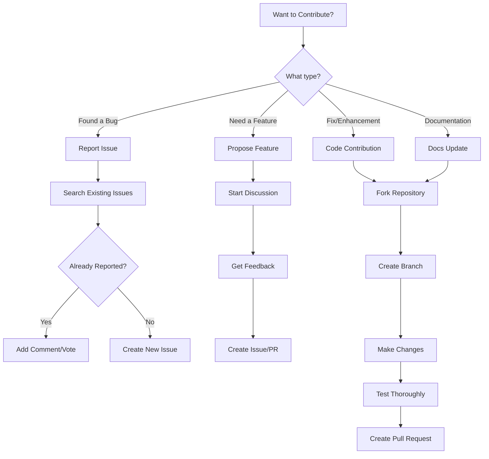

Your contribution is welcomed and appreciated. Contributing to this project is as easy as:

- Discussing the current state of the code
- Proposing new features
- Reporting an issue or bug
- Submitting a fix
- Creating a new report module

## Contribution Quick Guide

Not sure where to start? Here's a simple flowchart to guide you:



### Ways to Contribute

| Contribution Type | Difficulty | Time Commitment | Getting Started |
|------------------|------------|-----------------|-----------------|
| **Report Bugs** | Easy | 10-30 minutes | [Report an Issue](#reporting-issues-and-bugs) |
| **Documentation** | Easy | 30 mins - 2 hours | [Good First Issues](#good-first-issues) |
| **Bug Fixes** | Medium | 2-8 hours | [Submitting Pull Requests](#how-to-submit-code-contributions) |
| **New Features** | Medium-Hard | 1-5 days | [Code Contributions](#code-contributions) |
| **Report Modules** | Hard | 1-4 weeks | [Creating a Report Module](creating-a-report-module.md) |

## Getting Started with Contributions

### Good First Issues

New to AsBuiltReport or open source? Here are some great ways to get started:

#### Documentation Contributions

These require no coding experience and are perfect for beginners:

- **Fix typos or grammar** - Review documentation pages and fix errors
- **Improve examples** - Add real-world examples to command reference pages
- **Clarify instructions** - If something confused you, help clarify it for others
- **Add FAQ entries** - Document common questions you've encountered
- **Translate content** - Help translate reports into other languages

#### Low-Code Contributions

These require minimal PowerShell knowledge:

- **Update README files** - Improve module documentation
- **Add code comments** - Help document existing code
- **Improve error messages** - Make error messages more user-friendly
- **Create issue templates** - Help standardise bug reports

#### Testing Contributions

Help improve quality without writing code:

- **Test new releases** - Try beta versions and report issues
- **Reproduce bugs** - Verify reported issues
- **Test on different platforms** - Windows vs Linux vs macOS
- **Test with different PowerShell versions** - Windows PowerShell 5.1 vs PowerShell 7

#### Finding Good First Issues

1. Browse repositories for issues labelled `good first issue` or `help wanted`
2. Check the [Discussions board](https://github.com/orgs/AsBuiltReport/discussions) for questions you can answer
3. Review recent issues for documentation needs
4. Ask in Discussions: "What can I help with as a newcomer?"

!!! tip "First Contribution Tip"
    Start small! A successful small contribution builds confidence. Even fixing a single typo is valuable and gets you familiar with the contribution process.

### Git and GitHub Basics

Before contributing, ensure you're familiar with Git and GitHub:

#### Prerequisites

- Make sure you have a [GitHub account](https://github.com/signup/free){:target="_blank"}
- Learn Git basics:
    - [Learning Git and GitHub](https://help.github.com/articles/good-resources-for-learning-git-and-github/){:target="_blank"}
    - [Git Branching](https://learngitbranching.js.org/){:target="_blank"}

#### GitHub Workflow

This project uses GitHub to host code, to track issues and feature requests, as well as accept pull requests.

We use [GitHub Flow](https://docs.github.com/get-started/quickstart/github-flow){:target="_blank"} to collaborate and to propose changes to the codebase. We actively welcome your pull requests.

**Key Concepts:**

GitHub fosters collaboration through the notion of [pull requests](https://help.github.com/articles/using-pull-requests/){:target="_blank"}. On GitHub, anyone can [fork](https://help.github.com/articles/fork-a-repo/){:target="_blank"} an existing repository into their own user account, where they can make private changes to their fork. To contribute these changes back into the original repository, a user simply creates a pull request in order to "request" that the changes be taken "upstream".

Additional references:

- GitHub's guide on [Forking](https://docs.github.com/pull-requests/collaborating-with-pull-requests/working-with-forks/about-forks){:target="_blank"}
- GitHub's guide on [Contributing to Open Source](https://docs.github.com/get-started/exploring-projects-on-github/finding-ways-to-contribute-to-open-source-on-github){:target="_blank"}
- GitHub's guide on [Understanding the GitHub Flow](https://docs.github.com/get-started/quickstart/github-flow){:target="_blank"}

#### Branching Guidelines

- Always [create a new branch](https://docs.github.com/pull-requests/collaborating-with-pull-requests/proposing-changes-to-your-work-with-pull-requests){:target="_blank"} for your work, no matter how small
- Avoid submitting unrelated changes (bug fixes & new features) in the same branch/pull request
- Base your new branch off of the `dev` branch

## How to Submit Code Contributions

If you wish to discuss ways in which to contribute to the AsBuiltReport project, you may raise an [issue](https://docs.github.com/issues/tracking-your-work-with-issues/about-issues#working-with-issues){:target="_blank"} within the relevant [repository](https://github.com/AsBuiltReport){:target="_blank"}, or [email us](mailto:support@asbuiltreport.com).

### Creating Quality Pull Requests
A good quality pull request will have the following characteristics:

- When you create a pull request, include a summary about your changes in the PR description. The description is used to create change logs, so try to have the first sentence explain the benefit to end users. If the changes are related to an existing GitHub issue, please reference the issue in the PR description (e.g. *Fix #11*)
- It's recommended to avoid a PR with too many changes. A large PR not only stretches the review time, but also makes it much harder to identify issues. In such case, it's better to split the PR to multiple smaller ones. For large features, try to approach it in an incremental way, so that each PR won't be too big.
- Add a meaningful title of the PR describing what change you want to check in. Don't simply put: *"Fix issue #5"*. Also don't directly use the issue title as the PR title. An issue title is to briefly describe what is wrong, while a PR title is to briefly describe what is changed. A better example is: *"Add Ensure parameter to New-Item cmdlet"*, with *"Fix #5"* in the PR's body.

- Please use the present tense and imperative mood when describing your changes:
    - Instead of *"Adding support for Windows Server 2012 R2"*, write *"Add support for Windows Server 2012 R2"*.
    - Instead of *"Fixed for server connection issue"*, write *"Fix server connection issue"*.
- It will have a title that reflects the work within, and a summary that helps to understand the context of the change.
- There will be well written commit messages, with well crafted commits that tell the story of the development of this work.
- Ideally it will be small and easy to understand. Single commit PRs are usually easy to submit, review, and merge.
- The code contained within will meet the best practices set by the team wherever possible. If in doubt, please [contact us](../about/contact.md).

### Submitting Pull Requests

#### For Contributors (Submitting to `dev` branch)

Always create a pull request to the `dev` branch of a repository.

1. Fork an AsBuiltReport repository. The example below uses the main AsBuiltReport.Core repository in the command examples.
2. Add `https://github.com/AsBuiltReport/AsBuiltReport.Core.git` as a remote named `upstream`.
   * `git remote add upstream https://github.com/AsBuiltReport/AsBuiltReport.Core.git`
3. Create your feature branch from `dev`.
   * `git checkout dev`
   * `git checkout -b feature/your-feature-name`
4. Work on your feature.
   * Make commits with clear, descriptive messages
   * Update `CHANGELOG.md` in the repository you have worked in with add / remove / fix / change information
   * Update `README.md` in the repository you have worked in with any new information, such as features, instructions, parameters and/or examples
5. Ensure that your branch is up to date with `upstream/dev`.
   * `git checkout <branch>`
   * `git fetch upstream`
   * `git rebase upstream/dev`
6. Push branch to your fork.
   * `git push --force`
7. Open a Pull Request against the `dev` branch of a repository.

We have Pull Requests templates in all repositories for this project. Please follow the template with each Pull Request.

Pull requests will be reviewed as soon as possible. Maintainers will handle commit consolidation during the merge process.

#### For Maintainers (Releasing from `dev` to `master`)

When ready to create a release:

1. Ensure `dev` is stable and all tests pass
2. Open a Pull Request from `dev` to `master`
3. Review all changes that will be released
4. Merge the Pull Request (preserves full commit history)
5. After merging, sync `dev` with `master`:
```bash
   git checkout master
   git pull
   git checkout dev
   git rebase master
   git push --force origin dev
```
6. Tag the release on `master`
7. Update release notes

## Reporting Issues and Bugs

GitHub issues is used to track issues and bugs. Report a bug by opening a new [issue](https://docs.github.com/issues/tracking-your-work-with-issues/about-issues#working-with-issues){:target="_blank"} in the relevant [AsBuiltReport repository](https://github.com/AsBuiltReport){:target="_blank"}.

### Due Diligence
Before submitting a bug, or raising an issue, please do the following:

- Perform **basic troubleshooting** steps:
    - **Read the documentation.** Ensure you have read the `README` documentation within the relevant report repository. Check the `Supported Versions`, `System Requirements` and `Module Installation` sections.
    - **Make sure you're running the latest version.** If you're not on the most recent version, your problem may have been solved already! Upgrading is always the best first step.
    - **Review dependencies.** If the release in question has other dependencies (e.g. vendor PowerShell modules) try upgrading/downgrading those as well.
    - **Use `Verbose` parameter.** Add `-Verbose` parameter to the command line to see if the issue can be identified via the output.
    - **Disable report InfoLevels.** Edit the report config and set all InfoLevels to 0. Gradually increase InfoLevel values for each section individually, until you are able to recreate the issue. See the [Troubleshooting Guide](../support/troubleshooting.md#use-infolevel-to-isolate-issues) for detailed steps.
    - **Try older versions.** If you're already on the latest release, try rolling back a few minor versions (e.g. if on 1.7, try 1.5 or 1.6) and see if the problem goes away. This will help narrow down when the problem first arose in the commit log.
- **Search the open and closed issues within the relevant repository** to make sure it's not a current or previous known issue.

### What to Include in Your Issue Report
To make sure your issue gets the attention it deserves, please consider the information requested below as the bare minimum; more information is almost always better! Issues with missing information may be ignored or pushed back to you, delaying a resolution.

Great issue and bug reports tend to have:

- A quick summary and/or background of the issue
- Software versions you are using;
    - AsBuiltReport module versions (e.g. AsBuiltReport.Core v1.2.0 & AsBuiltReport.VMware.vSphere v1.3.1)
    - PowerShell versions (e.g. Windows PowerShell 5.1)
    - Operating System versions (e.g. Windows Server 2016 Version 1607)
- Steps to reproduce the issue;
    - Be specific
    - Provide the full command line you are executing
    - Give sample code if you can
    - Upload a screenshot if possible
- What you expected would happen
- What actually happens
- Notes (possibly including why you think this might be happening, or steps you have performed to resolve the issue)

## Code Contributions

### Code Editor

We highly encourage you use the multi-platform code editor [Visual Studio Code (VS Code)](https://code.visualstudio.com/docs){:target="_blank"} when developing code for AsBuiltReport.

### Coding Style Guidelines
Code contributors should follow the [PowerShell Guidelines](https://github.com/PoshCode/PowerShellPracticeAndStyle){:target="_blank"} wherever possible to ensure scripts are consistent in style.

Use [PSScriptAnalyzer](https://github.com/PowerShell/PSScriptAnalyzer){:target="_blank"} to check code quality against PowerShell Best Practices.

:octicons-check-circle-fill-16:{ .check-circle } DO

- Use [PascalCasing](https://docs.microsoft.com/en-us/dotnet/standard/design-guidelines/capitalization-conventions){:target="_blank"} for all public member, type, and namespace names consisting of multiple words.
- Use custom label headers within tables, where required, to make easily readable labels.
- Favour readability over [brevity](https://www.dictionary.com/browse/brevity){:target="_blank"}.
- Use [PSCustomObjects](https://docs.microsoft.com/en-us/powershell/scripting/learn/deep-dives/everything-about-pscustomobject?view=powershell-7){:target="_blank"} to store data that will be exported to a [PScribo](https://github.com/iainbrighton/PScribo){:target="_blank"} table. This helps with readability.
    - Use the following structure to create tables

        ```powershell title="Creating tables with PSCustomObject"
            # Create the PSCustomObject
            $myObject = [PSCustomObject]@{
                Name     = 'Tim'
                Language = 'PowerShell'
                City = 'Melbourne'
                State    = 'Victoria'
                Country = 'Australia'
            }
            # Set the table parameters - Table name, type & column widths
            # A list table is set and column widths are evenly set at 50% for each column
            $TableParams = @{
                Name = 'User Info'
                List = $true
                ColumnWidths = 40, 60
            }
            # This code snippet must be included for options to show table captions
            if ($Report.ShowTableCaptions) {
                $TableParams['Caption'] = "- $($TableParams.Name)"
            }
            # Output PSCustomObject to table using defined parameters
            $myObject | Table @TableParams
        ```

- Set `ColumnWidths` for all tables to improve formatting and readability. Try to maintain a consistent style throughout the report. Cell text will word wrap. List tables should generally use column widths of `40, 60`.
- Sort primary object properties in alphanumeric order.
- Try to perform all safe commands (Get-*, Get API call, etc) at the start of a report script so it can easily be seen what data is being collected.
- Use comments written in English, but don't overdo it. Comments should serve to your reasoning and decision-making, not attempt to explain what a command does.
- Maintain a change log as per [these guidelines](https://keepachangelog.com/en/1.1.0/){:target="_blank"}. The change log should be named `CHANGELOG.md`.

:octicons-x-circle-fill-16:{ .x-circle-fill } DO NOT
<!-- - Do not include code within report scripts to install or import PowerShell modules. Dependencies should be documented under the `System Requirements` and `Module Installation` sections of the `README`. -->
- Do not include functions within report scripts. Individual script files should be created as a private function and be stored in the `\Src\Private` folder.

### Testing Guidelines

Before submitting a pull request, thoroughly test your changes:

#### Manual Testing Checklist

- [ ] **Test with verbose output** - Run with `-Verbose` to catch warnings or errors
    ```powershell
    New-AsBuiltReport -Report YourModule -Target system.example.com -Credential $Cred -Verbose
    ```

- [ ] **Test all output formats** - Verify DOCX, HTML, and Text all generate correctly
    ```powershell
    New-AsBuiltReport -Report YourModule -Target system.example.com -Credential $Cred -Format Word,HTML,Text
    ```

- [ ] **Test different InfoLevels** - Verify each InfoLevel (0-5) works as expected
    - Start with InfoLevel 0 for all sections
    - Test each section individually at different levels
    - See [Troubleshooting - InfoLevel Testing](../support/troubleshooting.md#use-infolevel-to-isolate-issues)

- [ ] **Test with health checks** - If your module supports health checks, test with `-EnableHealthCheck`

- [ ] **Test error handling** - Verify graceful handling of:
    - Invalid credentials
    - Network connectivity issues
    - Missing/unavailable components
    - Insufficient permissions

- [ ] **Test on multiple platforms** (if applicable):
    - Windows PowerShell 5.1
    - PowerShell 7+ on Windows
    - PowerShell 7+ on Linux (if supported)
    - PowerShell 7+ on macOS (if supported)

#### Code Quality Checks

Run these checks before submitting:

```powershell title="PSScriptAnalyzer check"
# Install PSScriptAnalyzer if not already installed
Install-Module -Name PSScriptAnalyzer -Scope CurrentUser

# Run analysis on your module
Invoke-ScriptAnalyzer -Path .\Src -Recurse -Severity Warning,Error
```

#### Testing Best Practices

- **Test with real environments** - Use actual target systems, not mocked data
- **Test edge cases** - Empty environments, large environments, mixed versions
- **Document test results** - Include test results in your PR description
- **Test backwards compatibility** - Ensure changes don't break existing functionality
- **Verify documentation** - Check that README and examples match your changes

#### Performance Testing

For report modules, consider:

- **Large environment testing** - Test with environments that have many objects
- **Timing analysis** - Compare report generation time before and after changes
- **Memory usage** - Monitor PowerShell memory consumption during report generation

!!! tip "Testing Report Modules"
    Create a test configuration file with all InfoLevels set to different values to thoroughly test each section:

    ```json
    {
      "InfoLevel": {
        "Section1": 0,
        "Section2": 1,
        "Section3": 2,
        "Section4": 3
      }
    }
    ```

## Pull Request Review Process

### Review Timeline Expectations

We strive to review pull requests in a timely manner, but please be patient as all maintainers are volunteers:

| Review Stage | Typical Timeline | Notes |
|--------------|------------------|-------|
| **Initial Response** | 2-5 days | Acknowledgement of your PR |
| **First Review** | 5-10 days | Initial feedback on approach |
| **Follow-up Reviews** | 2-5 days | After you address feedback |
| **Final Approval** | 2-5 days | After all feedback addressed |
| **Merge** | 2-5 days | After approval |

!!! info "Factors Affecting Review Time"
    - **PR Size**: Smaller PRs are reviewed faster
    - **Complexity**: Simple fixes reviewed faster than new features
    - **Testing**: Well-tested PRs with clear documentation reviewed faster
    - **Holidays/Weekends**: Reviews may be delayed
    - **Maintainer Availability**: All maintainers are volunteers with day jobs

### What Happens During Review

1. **Automated Checks** - GitHub Actions runs automated tests
2. **Code Review** - Maintainers review code quality and adherence to guidelines
3. **Testing Verification** - Maintainers may test your changes
4. **Documentation Review** - Check that documentation is updated
5. **Feedback** - You may receive requests for changes
6. **Approval** - Once all feedback addressed, PR is approved
7. **Merge** - Approved PRs are merged to `dev` branch

### Improving Review Speed

You can help speed up the review process:

- **Follow guidelines** - Adherence to coding standards reduces back-and-forth
- **Include tests** - Show you've tested thoroughly
- **Write clear descriptions** - Explain what and why
- **Keep PRs focused** - One feature/fix per PR
- **Respond promptly** - Address feedback quickly
- **Be patient** - Maintainers will get to your PR

## License

### :octicons-file-badge-16: MIT License
By contributing, you agree that your contributions will be licensed under the [MIT License](../about/license.md).